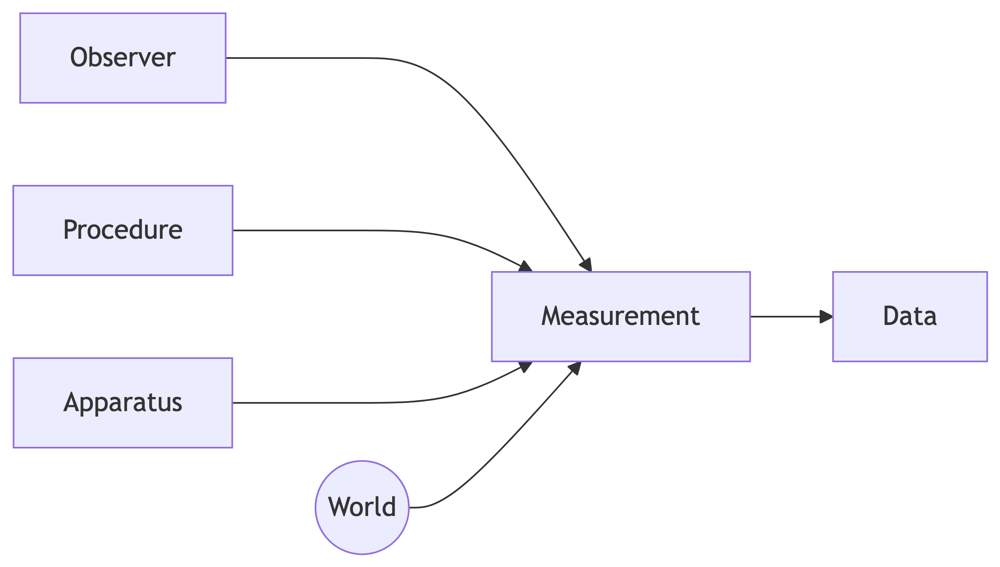
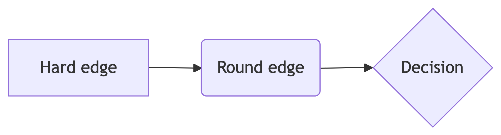

# make-multiple-mermaid-figs

Figure 1: A richer depiction of the process of measurement involving an
observer, some procedure, and an apparatus or measurement instrument.

Figure 2: Hard edge round edge.

Figure 3: A simple depiction of the process of generating data via
measurement.

