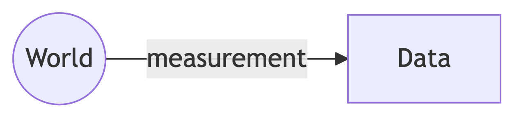
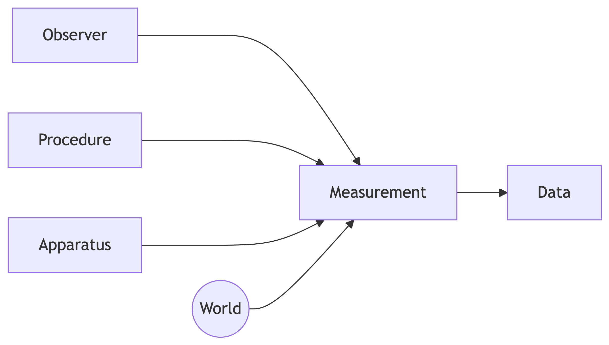

# Multiple mermaid figs

Figure 1: A simple depiction of the process of generating data via
measurement.

Figure 2: A richer depiction of the process of measurement involving an
observer, some procedure, and an apparatus or measurement instrument.

