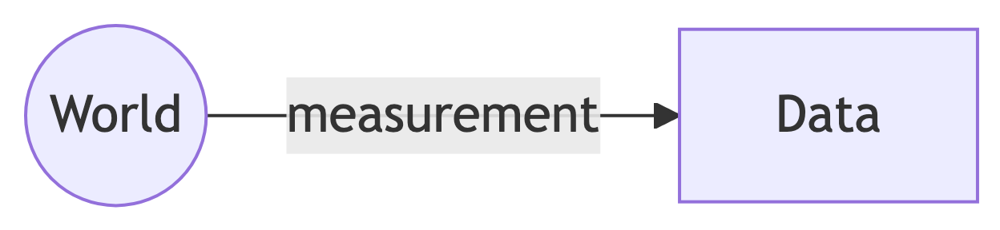
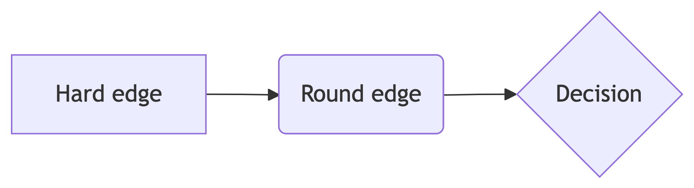

# Multiple mermaid figs

## Fig 01 quarto

## Fig 02 quarto

Figure 1: A simple depiction of the process of generating data via
measurement.

## Fig 03 quarto

Figure 2: A richer depiction of the process of measurement involving an
observer, some procedure, and an apparatus or measurement instrument.

## Fig 01 import

