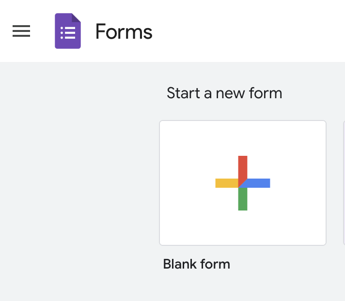
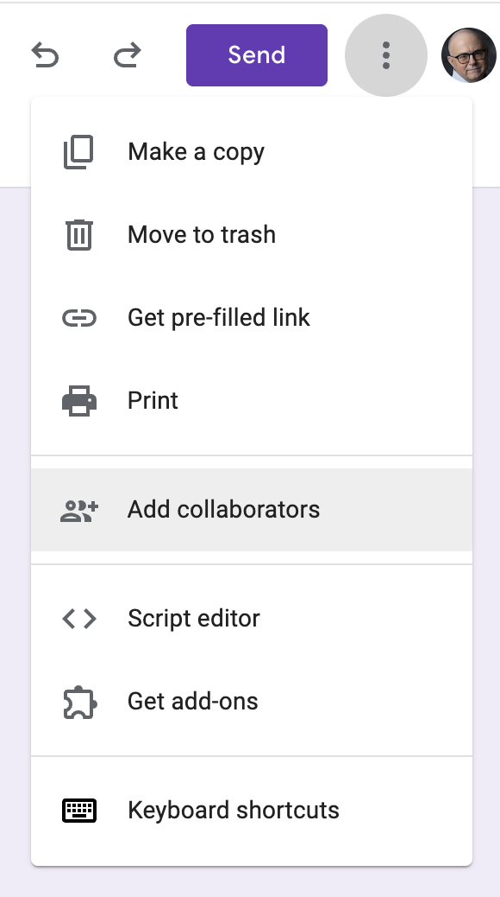

## Dates {-}

In-class work on Tuesday, January 28 and Thursday, January 30.

Submit write-up for credit [due]{.orange_due} by Tuesday, Feburary 11.

## Goals {-}

In this exercise, you will work alone or with a team of no more than two other classmates to create a survey using the Google [Forms](https://forms.google.com) tool.
The survey you create will be used later in the course for data visualizations that you will also create.

## Assignment {-}

0. Sign-in to the Google drive account associated with your Penn State Access ID. This will make it somewhat easier for us to share forms.
1. Open Google Forms by visiting <https://forms.google.com>.
2. Create a new form by clicking on the 'Blank Form' button.

{fig-google-form-blank-form}
3. Give your form a useful title, for example, 'PSYCH-490.003-2025-spring-team-A' or 'PSYCH-490.003-2025-spring-rog1'.

::: {.callout-important}
You can be assigned a team name/letter if you choose.

If you 
:::

4. Customize the theme if you wish by clicking on the palette icon.

5. Create a survey with 8 questions. Your questions should be ones that your classmates can answer without embarrassment or loss of privacy and which meet the following criteria:

- Generate two questions with nominal (un-ordered) answers (e.g., favorite color).
- Generate two questions with ordinal (e.g., 1-5) answers analogous to a [Likert](https://en.wikipedia.org/wiki/Likert_scale) scale.
- Generate two questions with continuous answers (e.g., age and shoe size). It doesn't matter if these are interval or ratio scaled.
- Generate one question with a date or time as an answer (e.g., a favorite relative's birthday).
- Include one field for comments.

6. When you are happy with a draft of your survey, conduct a quality assurance (QA) review of it by having your team or someone else take the survey. The easiest way to do this is to use the 'Send' button to send your survey to you collaborator(s).

Make sure to have your QA testers answer the Comments question with the same response, e.g., 'test-response'. This will make it easier later to filter-out the test responses.

7. Make sure that all of your collaborators have edit privileges on the form. Click on the 'more' button with three dots and add collaborators.

## Submit {-}

Whether or not you are submitting a write-up for Exercise 03, please add Dr. Gilmore (rog1@psu.edu) and Sara He (cfh5558@psu.edu) as collaborators on the survey so that we can all benefit from your good work.

Please also add the URL to your survey to this Google Sheet:

<https://docs.google.com/spreadsheets/d/1Z-TJQLOQ-yFBs0UimtCtv4pWIqcfq7jhAUA1QjVX89w/edit?usp=sharing>

If you are submitting a short 2-4 page write-up via Canvas, please provide answers to the following questions:

1. What is a *defining* feature of data items that are nominal? \
2. What assumptions might analysts make about *ordinal* data when it comes time to visualize or analyze the results? \
3. What assumptions must a researcher make when conducting survey research of this sort? \
4. Focusing on those available within Google Forms, what user interface(s) work best for different types of data? \
5. If you've used Qualtics previously to generate surveys, briefly compare Qualtrics with Google Forms.

