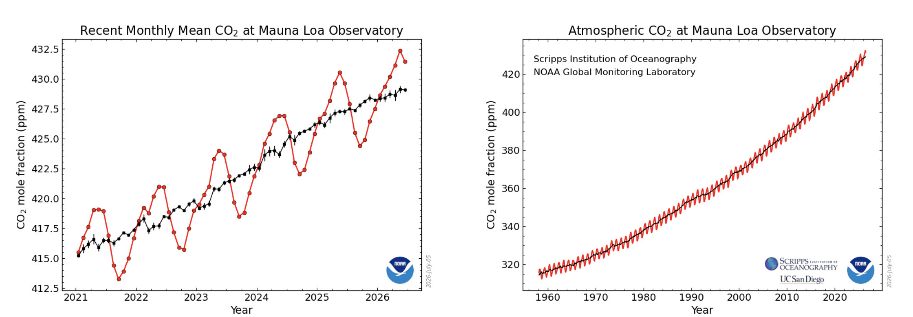
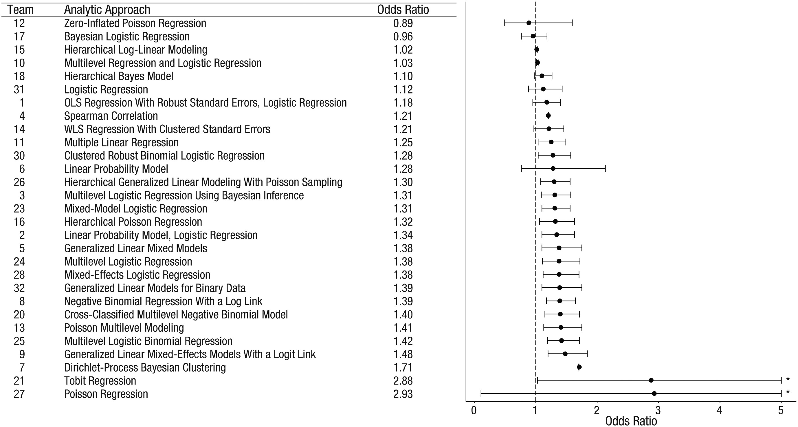
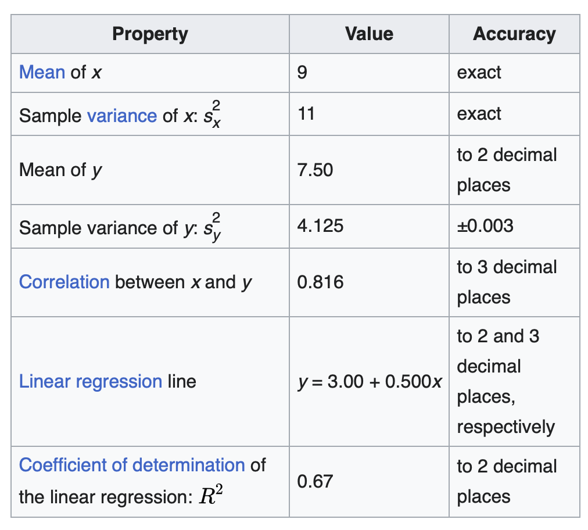
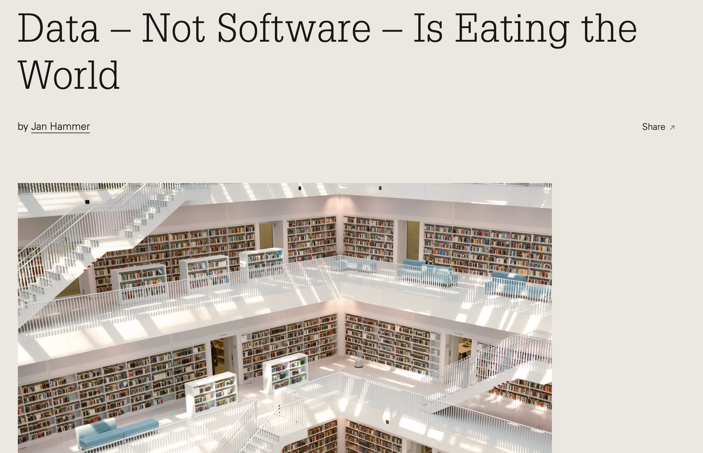

# Preliminaries

---

::: {#fig-hans-rosling}
<iframe width="1240" height="450" src="https://www.youtube.com/embed/jbkSRLYSojo?si=EVAEulLIsmNtyi0q" title="YouTube video player" frameborder="0" allow="accelerometer; autoplay; clipboard-write; encrypted-media; gyroscope; picture-in-picture; web-share" referrerpolicy="strict-origin-when-cross-origin" allowfullscreen></iframe>

@BBC2010-tj
:::

---

::: {#fig-if-a-picture-paints}
<iframe width="1240" height="450" src="https://www.youtube.com/embed/IQyKMueMFGk?si=UUWNmygz10iWemeu" title="YouTube video player" frameborder="0" allow="accelerometer; autoplay; clipboard-write; encrypted-media; gyroscope; picture-in-picture; web-share" referrerpolicy="strict-origin-when-cross-origin" allowfullscreen></iframe>

@Iso2016-wd
:::

## A picture is worth a thousand words...

- "An [adage](https://www.merriam-webster.com/dictionary/adage) in multiple languages..." [Wikipedia](https://en.wikipedia.org/wiki/A_picture_is_worth_a_thousand_words)
- Theme for the course

## What words does this figure convey...

{#fig-climate-dashboard}

## Or these?

::: {#fig-trends-in-co2-noaa}


@NOAA-Global-Monitoring-Laboratory2024-gw
:::

## Today

- Introduction to the course
- Visualization in psychological science

# Introduction to the course

## People

<!-- - Sara He, MS, Graduate Student -->
- Rick Gilmore, Professor of Psychology

## Why this course, why now

## My journey

- Cognitive Science major, psycholinguistics & [semiotics](https://en.wikipedia.org/wiki/Semiotics) minor
- Introduced to vision science via [Marr](https://en.wikipedia.org/wiki/David_Marr_(neuroscientist)) and [J.J. Gibson](https://en.wikipedia.org/wiki/James_J._Gibson)
- [Research](https://gilmore-lab.github.io) in visual development, visual neuroscience

---

](../include/img/databrary-nav.svg){height=250px}

## {background-iframe="https://penn-state-open-science.github.io"}

## Many analysts



## Many failures

[Visualizing the 'Many Analysts -- @Silberzahn2018-st -- data ](https://psu-psychology.github.io/psych-490-reproducibility-2024-fall/supplemental/many-viz.html)


## "Plot your data!"


---

:::: {.columns}
::: {.column width=50%}
{#fig-anscombes-quartet-data-wikipedia}
:::
::: {.column width=50%}
::: {.fragment}

:::
:::
::::

---

```{r}
#| label: fig-datasaurus-dozen
#| fig-cap: "The DatasauRus dozen [@datasaurus2019-us; @Matejka2017-xi; @datasauRus]"
library(datasauRus)
library(ggplot2)
library(gganimate)

ggplot(datasaurus_dozen, aes(x=x, y=y))+
  geom_point()+
  theme_minimal() +
  transition_states(dataset, 3, 1) + 
  ease_aes('cubic-in-out')
```

## Not all plots are equivalent


---


---


## Vision can be unreliable or ambiguous

::: {#visual-illusions layout-ncol=2}


:::

---



## Purpose & goals

::: {.incremental}
- What are data? Where do data come from?
- Who visualizes data, how do they visualize it, and why?
- How does vision science inform how we perceive patterns in data?
- What's the relationship between non-visual and visual ways of understanding data?
- What makes a data visualization effective?
- What makes a data visualization misleading?
- How can we make better data visualizations?
:::

## Schedule

<https://psu-psychology.github.io/psych-490-data-viz-2026-fall/schedule.html>

## Exercises & evaluation

- Exercises
  - 8 @ 10 pts/each
  - Top 4 count
  - Others count toward partial extra credit up to 10 pts
- Attendance (up to 40 points)
- Final project (40 points)

## Resources

- This site: <https://psu-psychology.github.io/psych-490-data-viz-2026-fall/>
<!-- - [Canvas](https://psu.instructure.com/courses/2280122) -->
- University Library

---

- Articles
  - Retrieve them yourself via the URL (uniform resource locator) and the digital object identifier ([DOI](https://www.doi.org))
  - Why do I do this?
    
## Structure

- Meet 3x weekly
  - Monday & Wednesday
    - Lecture + discussion (maybe short work session)
  - Friday (hands-on work session)
- Do your homework

## This is a seminar...


## Culture & climate

::: {.incremental}
- Creating a community of inquiry
- Encouraging vigorous & constructive criticism
- Criticism of *work/ideas/behaviors* vs. *people*
  - 'Smith thinks that pigs can fly.'
  - 'Smith is an idiot.'
  - 'Smith tried to demonstrate that pigs can fly by tossing a few off the 
  roof of Old Main. That's nonsense, is cruel to animals, and made a huge mess.'
:::

# Visualization in psychological science

## Exercise 01

- Visit [Exercise-01](../exercises/ex01-figs-in-psych-sci.qmd)

```{r}
#| echo: false
#| fig-align: center
plot(qrcode::qr_code("https://psu-psychology.github.io/psych-490-data-viz-2026-fall/exercises/ex01-figs-in-psych-sci.html"))
```

# Main points

- Visualizing data is important
- Visualizing data is interesting
- Data visualization encapulates multiple ideas from psychological science

# Next time

*The semiotics of data visualization*

# Resources

## References
