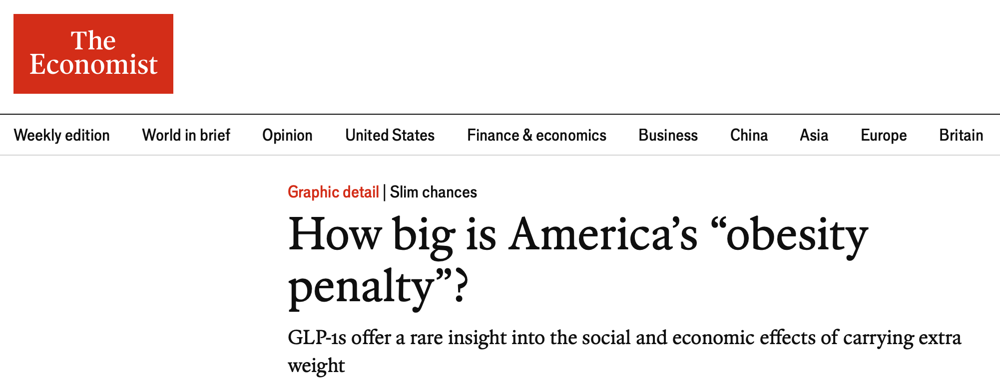
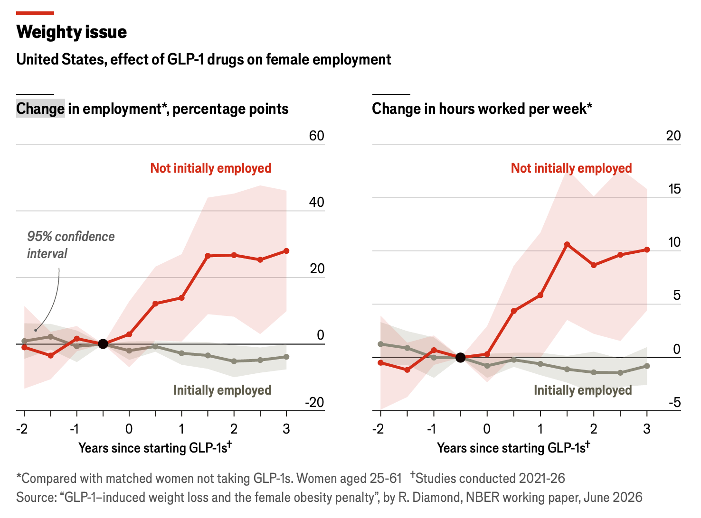
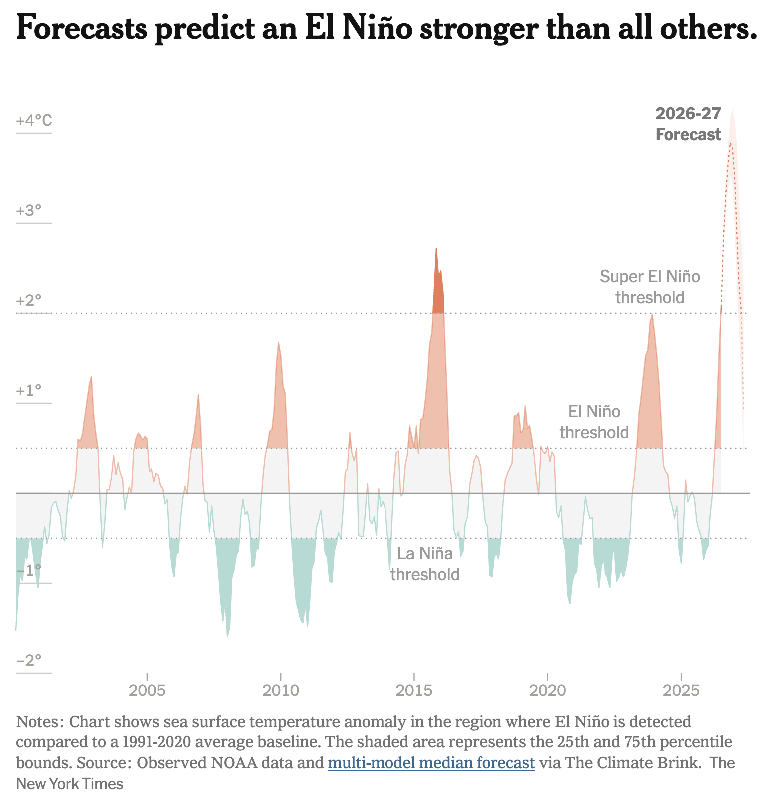
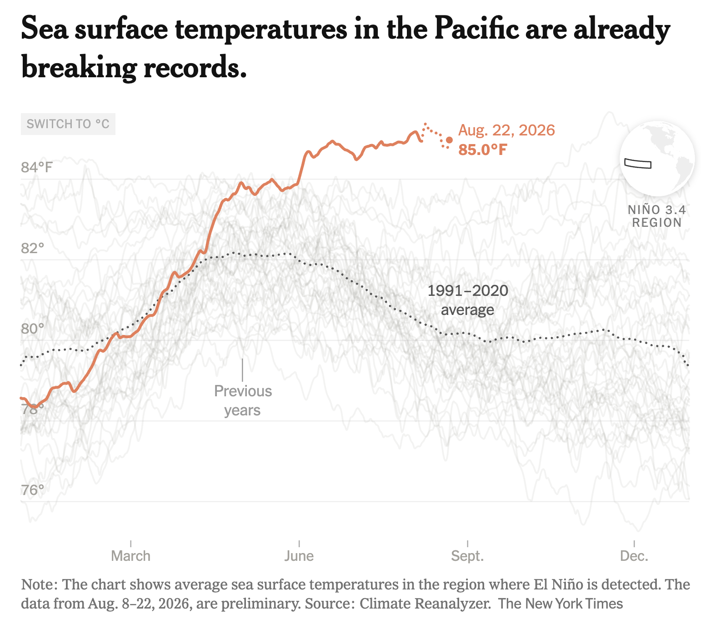
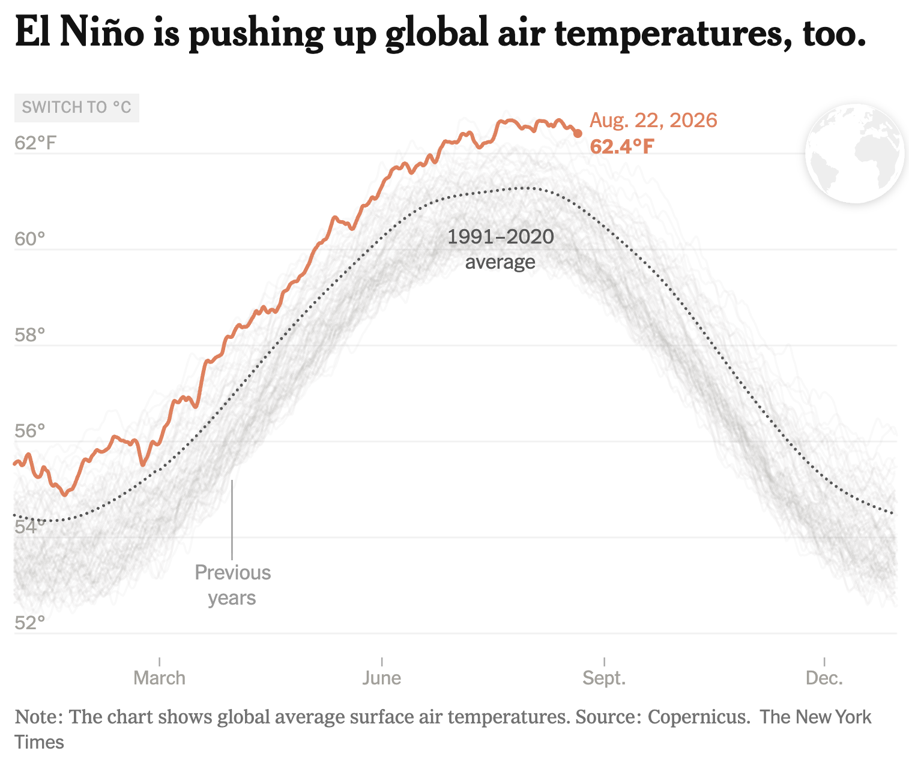
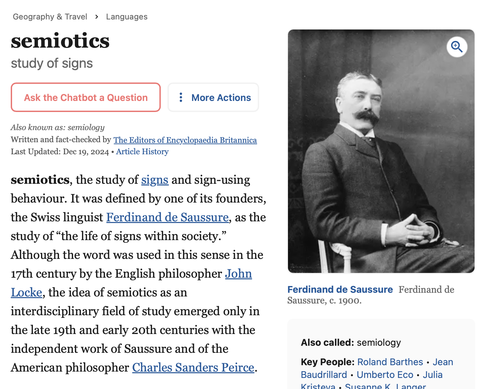
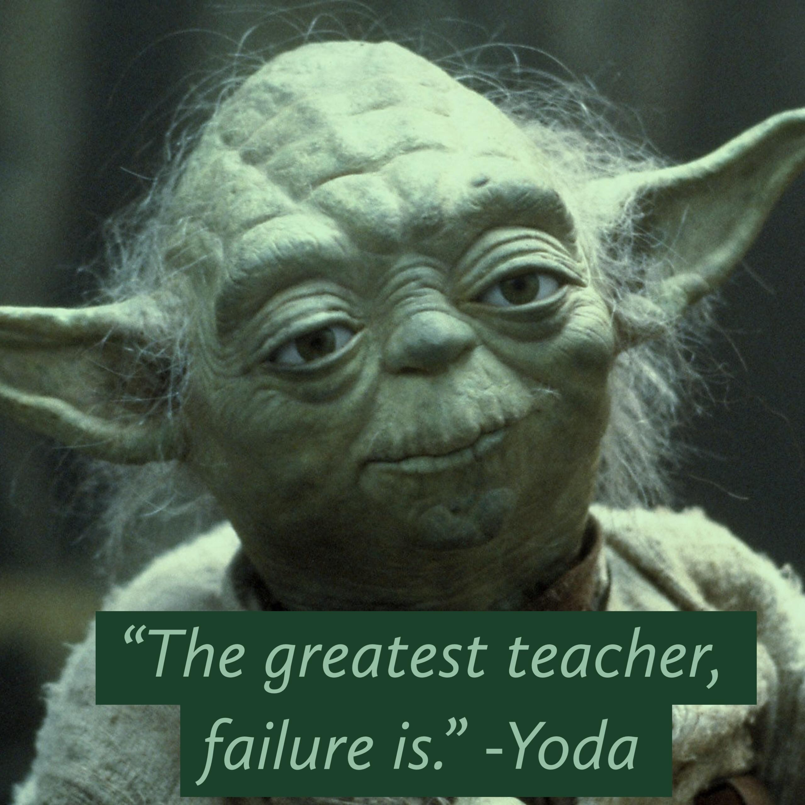
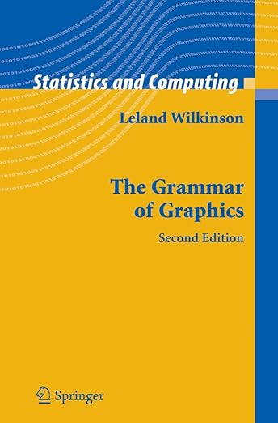
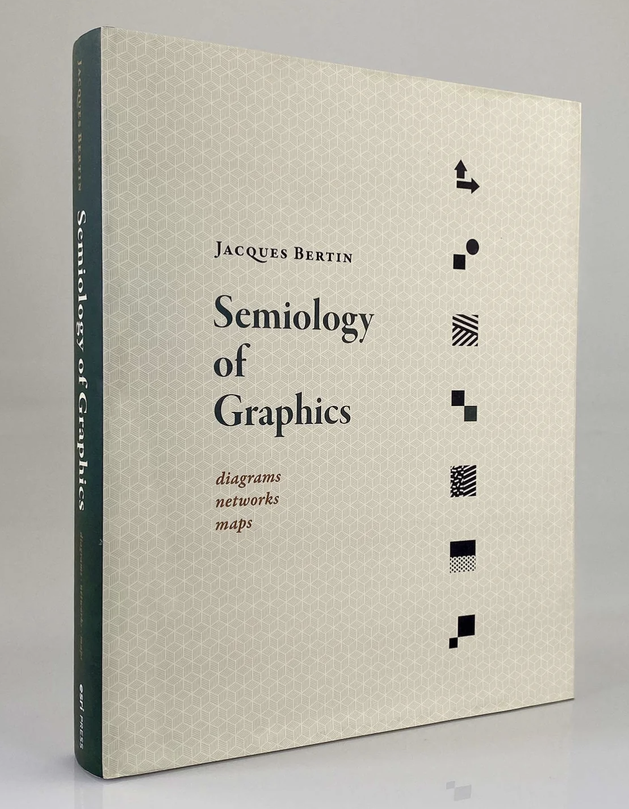

# Preliminaries

## William Playfair (1759-1823)

:::: {.columns}
::: {.column width=30%}
- "engineer, political economist, and scoundrel" [@Spence2017-hp]
- Founder of graphical methods of statistics
:::
::: {.column width=70%}
{#fig-playfair-time-series width="60%"}
:::
::::

## William Playfair (1759-1823)

:::: {.columns}
::: {.column width=30%}
- Introduced line, area, and bar chart
- Likely published first pie chart and circle graphs
:::
::: {.column width=70%}

:::
::::

# Overview

## Announcements

- Free access to newspapers!
- <https://studentaffairs.psu.edu/involvement-student-life/student-services/student-news-readership-program>
- Good sources of data visualizations
  
## In the news...

{#fig-economist-obesity-penalty}

---

{#fig-economist-obsesity-data width="70%"}

## {.center}

{#fig-nyt-el-nino-01 width="50%"}

## 

{#fig-nyt-el-nino-fig-02 width="50%"}

## 

{#fig-nyt-el-nino-fig-03 width="50%"}

## Last time...

- Course introduction

## Today

- Semiotics of data visualization
- Work session
  - [Exercise-01](../exercises/ex-01-figs-in-psych-sci.qmd)
  - Install R, RStudio, Quarto (if time)
  
# Semiotics of data visualization

## Semi-whatics?

{#fig-saussure width="60%"}

## The *symbolic* animal

:::: {.columns}
::: {.column width=35%}
](https://upload.wikimedia.org/wikipedia/commons/3/33/Ernst_Cassirer.jpg?utm_source=en.wikipedia.org&utm_campaign=imageinfo&utm_content=thumbnail_unscaled){#fig-cassirer}
:::
::: {.column width=65%}
>Cassirer argues that the classic Aristotelian definition of the human being as a rational animal is wrong, or at least incomplete. Instead we should think of ourselves as “symbolic animals,” since ratiocination^[The process of exact thinking. <https://www.merriam-webster.com/dictionary/ratiocination>] is only one expression of the human instinct to think in symbols. 

@Kirsch2021-fd
:::
::::

## The *communicating* animal {.nostretch}

- Communication as transmission of information
- From world

```{mermaid}
%%| fig-width: 10
flowchart LR
  A((World)) --> B[You]
```

## Communication

- From others (direct)

```{mermaid}
flowchart LR
  A[Me] --> B[You]
```

::: {.fragment}
- From others (via some medium^[*Media* is the plural form of medium.])

```{mermaid}
flowchart LR
  A[Me] --> B((Medium))
  B --> C[You]
```

:::

## Media

- Source of [*signs*](https://en.wikipedia.org/wiki/Sign_(semiotics))^[more general than language]
- Sign *relation*
  - Sign (as a thing) --> Meaning
  - Relation is arbitrary, defined by social convention (Sausurre)
  
---
  


## Your turn

::: {.question}
## Can you think of another context where the symbol "A" is used in a way that is different from its use in written language?
:::

::: {.fragment}
::: {.answer}

$$y=Ax+b$$

:::
:::

## Core qualities of sign systems

- Semantics
  - Relations between signs --> meaning
- Syntax (grammar)
  - Rules/conventions for arranging signs
  
## Multiple input channels

:::: {.columns}
::: {.column width=40%}
- Acoustic
- Tactile
- Olfactory
- Visual
:::
::: {.column width=60%}

:::
::::

## Your turn {.center}

::: {.question}
## What sign or symbol systems rely on these channels?

- Haptic (touch)
- Echoic (sound)
- Iconic (light)
- Olfactory (aroma)
- Gustatory (flavor)
:::

## Signs vary in 'meaningfulness'

:::: {.columns}
::: {.column width=50%}

:::
::: {.column width=50%}

:::
::::

## Communication between minds

- Via signs and symbols
- Based on shared social conventions
- About sign relations (what signs "mean" or convey)
- Open vs. closed symbol systems

## Sign systems serve many purposes

:::: {.columns}
::: {.column width=50%}
- unite/inform
- divide/confuse
:::
::: {.column width=50%}
{#fig-steiner-after-babel}
:::
::::

## Sign system grammars^[Orderly system of rules for arranging symbols.]

:::: {.columns}
::: {.column width=50%}
- $2+2*3=4$ vs. $2+(2*3)=4$
- "Up with you I will not put." vs. "I will not put up with you."
:::
::: {.column width=50%}
{#fig-yoda width="75%"}
:::
::::

## Grammar of Graphics

:::: {.columns}
::: {.column width=50%}
{#fig-wilkinson-grammar-of-graphics height=450px}
:::
::: {.column width=50%}
{#fig-ggplot2-book height=450px}
:::
::::

## How scientists communicate (formally)

- Papers
- Posters
- Textbooks
- Websites
- Talks

## Components of a scientific papers

:::: {.columns}
::: {.column width=50%}
- Text
  - Explanation/argument
  - Evidence (statistical summaries)
- Figures
:::
::: {.column width=50%}
- Tables
  - Evidence (statistical summaries)
- References
- Data, materials
:::
::::

## An aside about Quarto

- Quarto can be used to generate many of the components of a research document
- One text document combines text, data analysis, links, images, and more
- Generates multiple outputs: HTML, PDF, Word, PowerPoint, etc.

## Questions about scientific communication

- What do the words mean?
- What do the numbers/statistics mean?
- What do the figures mean?
- Does the evidence (+ argument) persuade?

## Semiotics/Semiology of Graphics

{#fig-bertin-semiology width="35%"}

## Semiotics of data visualization

- What do the components (of a figure) mean?
- What message is the visualization creator trying to convey?

## {.center}

```{mermaid}
%%| label: fig-measurement-process
%%| fig-cap: "The measurement & reporting process"
flowchart LR
  A((Person)) ---> B[Measure]
  F((Researcher)) ---> B
  F ---> A
  B ---> G(Text)
  B ---> C(Data)
  C ---> D[Statistics]
  C ---> E[Visualization]
```

## {.center}

```{mermaid}
%%| label: fig-perception-process
%%| fig-cap: "The perception process"
flowchart LR
  C(Data) -.-> D[Statistics]
  C -.-> F
  C -.-> E[Visualization]
  E ---> A((Student))
  D ---> A
  A ---> A
  F[Text] ---> A
```

---

::: {.callout-warning}
A semiotic perspective can be infectious and addictive.

Signs and sign systems are *everywhere*!

{height=350px}
:::

# Wrap-up

## Main points

- Semiotics of data visualization
  - *Semiotics*: study of signs and symbols
  - What meanings do the visual elements of data graphics convey?
  - How do data visualizations relate to other communicative elements?
  
# Work session

## Install R and RStudio

-  [*Tutorial*](../tutorials/tutorial-install-r-rstudio.qmd)

## Work on Exercise 01

- [Assignment](../exercises/ex-01-figs-in-psych-sci.qmd)
- [Google Sheet](https://docs.google.com/spreadsheets/d/10B44tuL2ERqGQaJw7vxu1ZFsIOcDbMw3kjfTy-jrFB4/edit?usp=sharing) for capturing & sharing data

## Next time

- Work session: Introducing [Quarto](https://quarto.org)

# Resources

## References
