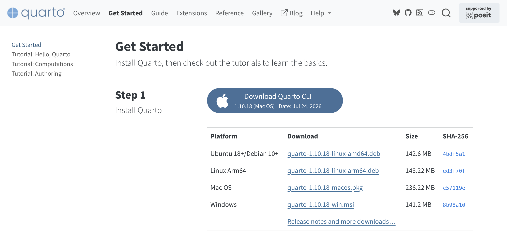
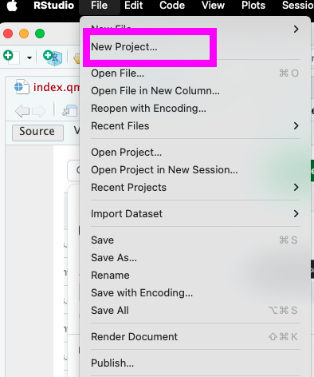
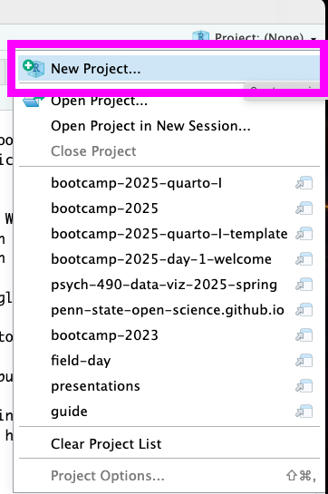
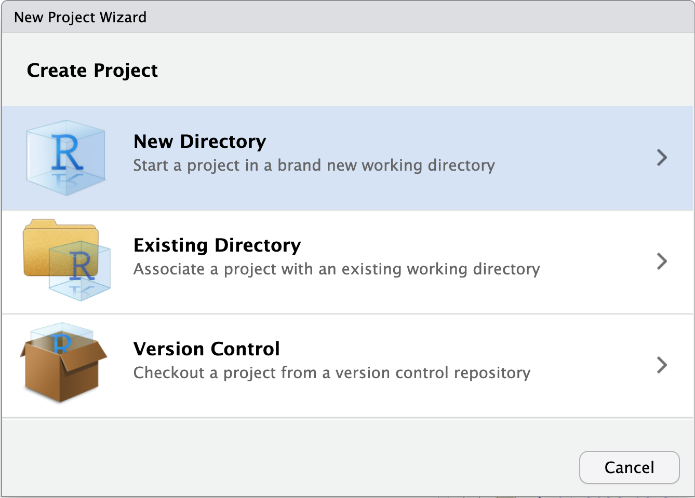
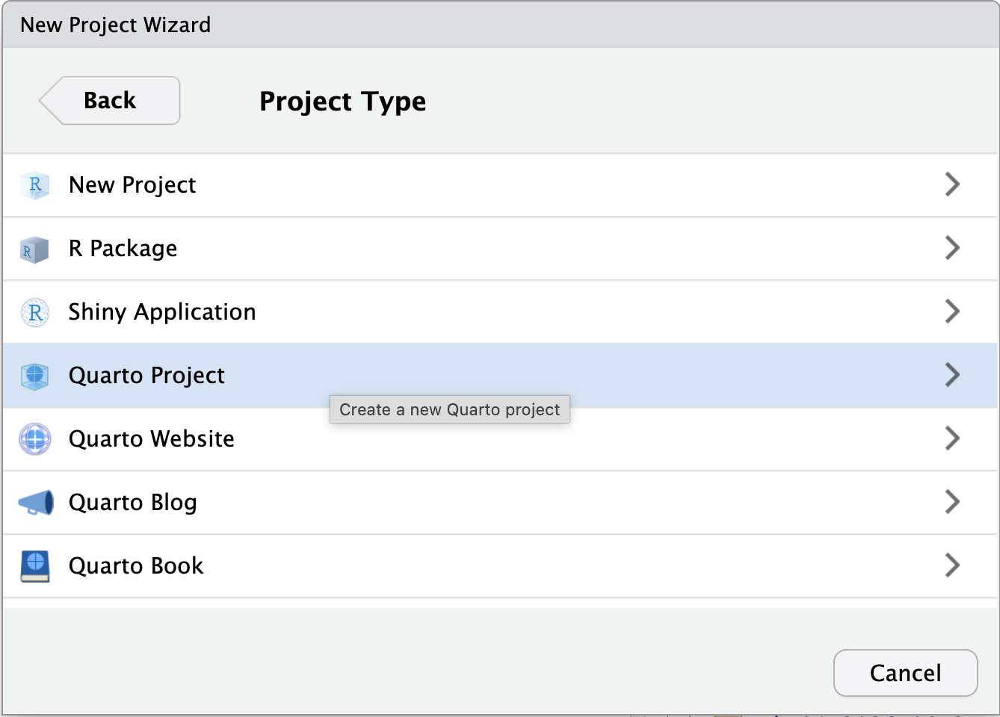
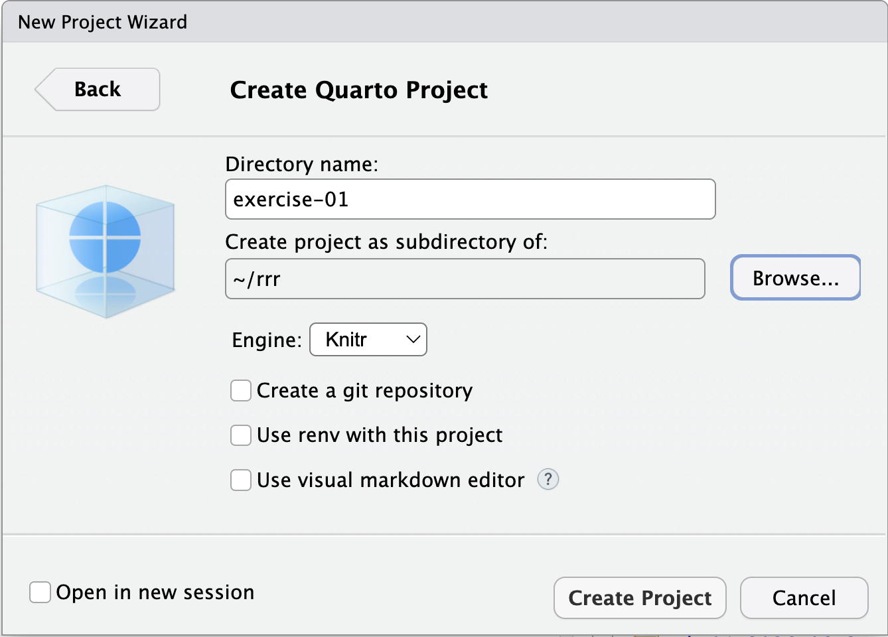
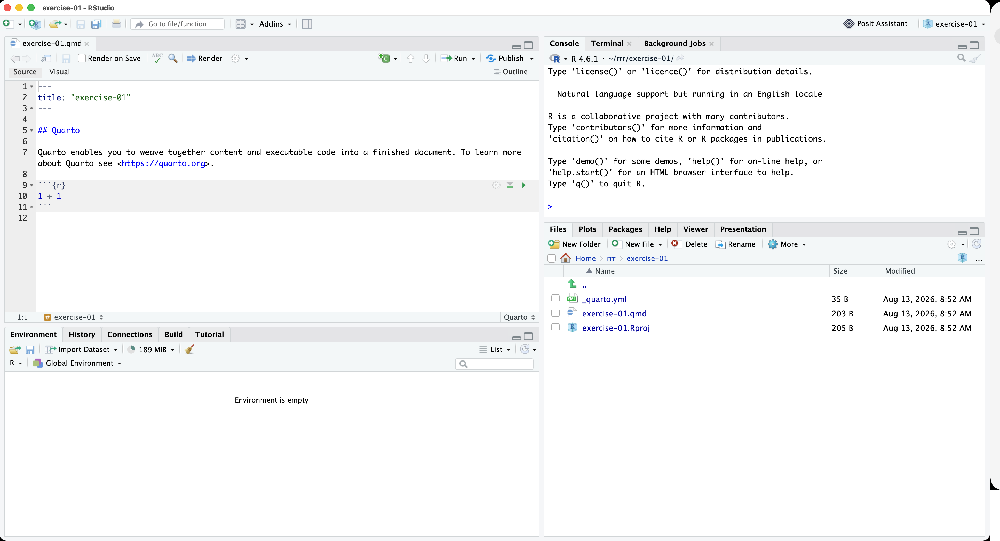
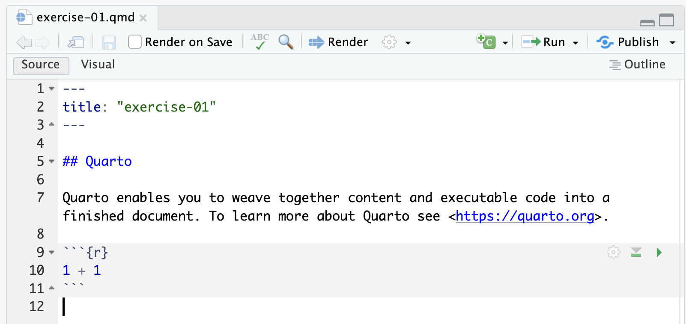
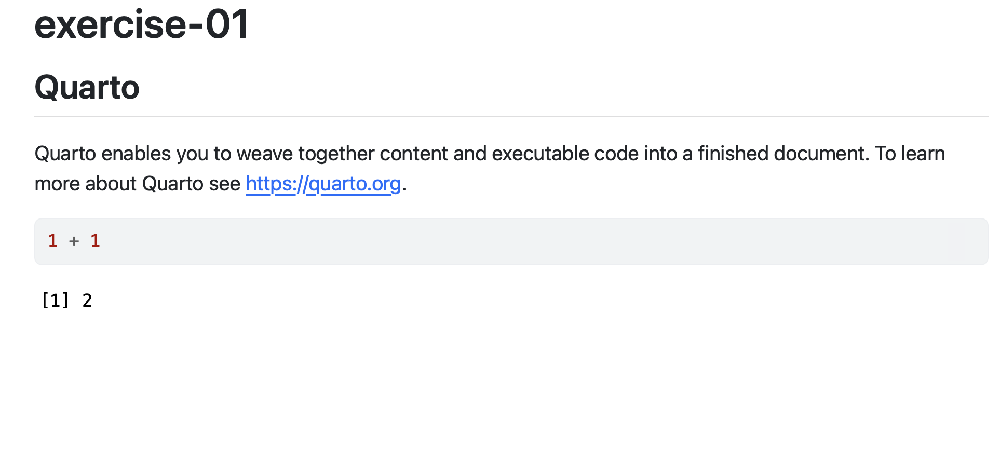

# Preliminaries

## Announcements

- Exercise 01 due next Friday, September 4, 2026 (midnight).
- Submit Quarto document to [ *Canvas dropbox* ](https://psu.instructure.com/courses/2484925/assignments/18448425)

## Today's topics

- Warm-up
- Troubleshooting R and RStudio installations
- Introducing Quarto
- Using Quarto for Exercise 01

# Warm-up

---

::: {.question}
## What's a widely recognized sign system in (American) football?
:::

::: {.fragment}
::: {.answer}
::: {#fig-football-signals}
<iframe width="283" height="504" src="https://www.youtube.com/embed/slroyCXa9pw" title="Basic Referee signals you need to know #football #football101 #nflsports" frameborder="0" allow="accelerometer; autoplay; clipboard-write; encrypted-media; gyroscope; picture-in-picture; web-share" referrerpolicy="strict-origin-when-cross-origin" allowfullscreen></iframe>
:::
:::
:::

# Troubleshooting R and RStudio installations

# Introducing Quarto

## Installing Quarto

{#fig-installing-quarto}

## Launch RStudio

## Create New Project

:::: {.columns}
::: {.column width=50%}
{fig-align="center" #fig-file-menu-new-project}
:::
::: {.column width=50%}
{fig-align="center" #fig-new-project-project-manager width="60%"}
:::
::::

---

{#fig-create-project-new-directory width="75%"}

---

{#fig-create-project-type-quarto width="75%"}

---

{#fig-create-project-quarto-name width="75%"}

---

::: {.callout-important}
## Learn from expert practices
- Establish a clear file/project scheme
  - Stick with it
  - I use: `~/rrr/psych-490-exercise-01`
  - Why? Someone who knows more than I do suggested it.
- No spaces in files and folder/directory names
- Put info in file/folder name: `psych-490-exercise-01`
:::

## Explore project (and document)

## Anatomy of Quarto document

:::: {.columns}
::: {.column width=40%}
- Text, has `.qmd` extension
- Metadata^[Data about data.] information (b/w pairs of `---`)
- Section headers
  - `##` means a 2nd level header
- Code chunks!
:::
::: {.column width=60%}
{#fig-exercise-01-file align="right"}
:::
::::

## *Render* the file

- Turn the text file into something else
  - Webpage (HTML)
  - Document (PDF, Word)
  - Slides
- Default is webpage (HTML)
- I recommend checking "Render on Save"

## Rendered file

## Copy Quarto template

# Work on Exercise 01

## 

## Main points

## Next time

- *Visualization in government & business*
- Results of visualization in psychological science exercise

# Resources

## About

This talk was produced using [Quarto](https://quarto.org), using the [RStudio](https://posit.co/products/open-source/rstudio/)
Integrated Development Environment (IDE), version 2026.1.0.392.

The source files are in R and R Markdown, then rendered to HTML using the
[revealJS](https://revealjs.com) framework.
The HTML slides are hosted in a [GitHub repo](https://github.com/psu-psychology/psy-511-scan-fdns-2026-spring) and served by GitHub pages:
<https://psu-psychology.github.io/psy-511-scan-fdns-2026-spring/>

## References