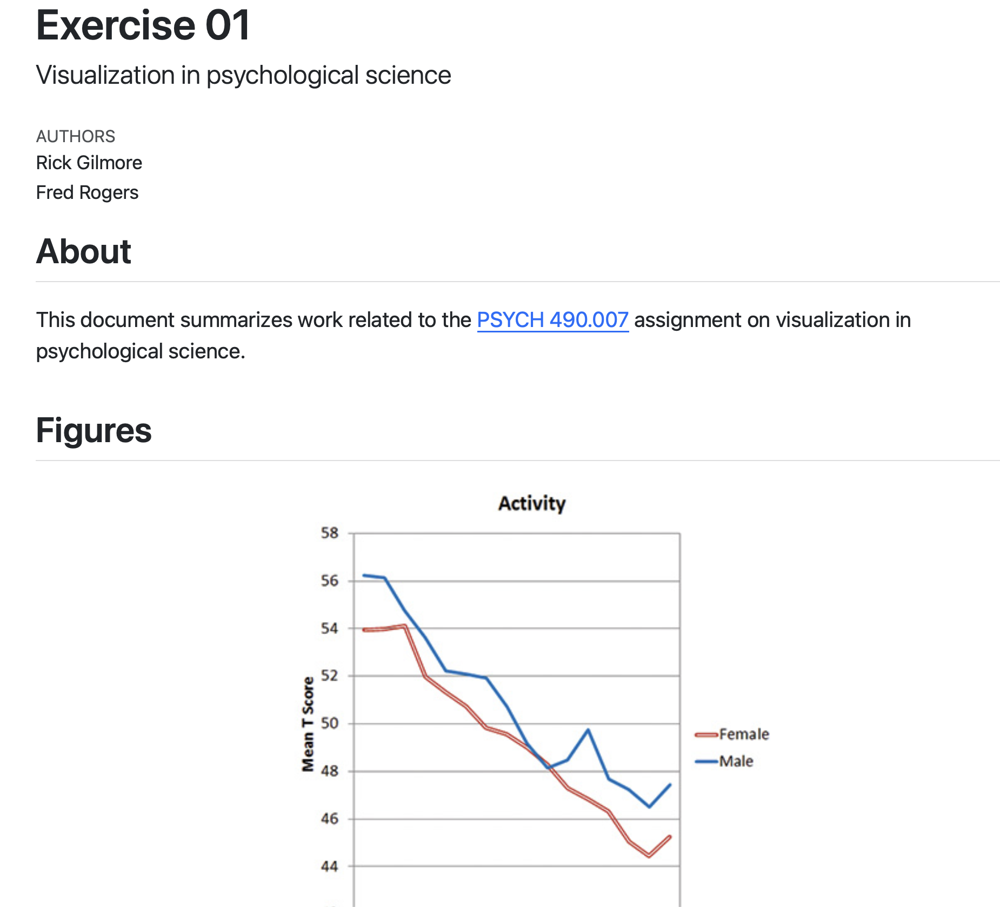

# Preliminaries

## Announcements

- Exercise 01 due next Friday, September 4, 2026 (midnight).
- Submit Quarto document to [ *Canvas dropbox* ](https://psu.instructure.com/courses/2484925/assignments/18448425)

## Today's topics

- Troubleshooting R and RStudio installations
- Introducing R and RStudio
- Exercise 01

# Warm-up

---

::: {.question}
## What's a widely recognized sign system in (American) football?
:::

::: {.fragment}
::: {.answer}
::: {#fig-football-signals}
<iframe width="283" height="504" src="https://www.youtube.com/embed/slroyCXa9pw" title="Basic Referee signals you need to know #football #football101 #nflsports" frameborder="0" allow="accelerometer; autoplay; clipboard-write; encrypted-media; gyroscope; picture-in-picture; web-share" referrerpolicy="strict-origin-when-cross-origin" allowfullscreen></iframe>
:::
:::
:::

# Troubleshooting R and RStudio installations

# Introducing R & RStudio

## R

:::: {.columns}
::: {.column width=50%}
- Programming language
- Set of symbols 
  - syntax/grammar
  - semantics
- "Talk" to your computer

:::
::: {.column width=50%}

:::
::::

## RStudio

:::: {.columns}
::: {.column width=50%}
- An integrated development environment (IDE) for R
- Toolbox for R programmers
- Yes, mom, I'm a programmer now
:::
::: {.column width=50%}

:::
::::

## RStudio

- Console
  - Talk to computer using R
- Editor
  - Make text files
- Files
  - Manage (rename, move, delete) files
- Edit arrangement via `View/Panes/Pane Layout...` menu

## Console

:::: {.columns}
::: {.column width=50%}
- Say something (type)
- Press \<enter\> or \<return\> key
- Get an answer
:::
::: {.column width=50%}
- Try this: type `date()` and hit \<enter\>

```{r}
#| label: fig-r-date
#| echo: true
date()
```
:::
::::

## Semiotics of R

:::: {.columns}
::: {.column width=50%}
- Things
  - Names
  - Values
  
:::
::: {.column width=50%}
- Things
  - `name`
  - `age`
- Values
  - `name`: "Yoda"
  - `age`: "900 years"^[https://share.google/aimode/m4uVbqawZD0Gv0ZkS]
:::
::::

## Semiotics of R

:::: {.columns}
::: {.column width=50%}
- Commands/functions
:::
::: {.column width=50%}
- Command/function
  - `date()`
  - `name <- "Yoda"`
  - `age <- 900"`
:::
::::

## Grammatical rules

- Names
  - Letters, underscores, numbers
  - No quotation marks
- Values
  - Character strings (inside quotation marks)
  - Numeric values (no quotation marks)
  
## Grammatical rules

:::: {.columns}
::: {.column width=50%}
- Assignment: `<-`
  - Give some value a name
- Commands
  - Command name plus parentheses (`date()`)
  - Tell me the value of a named thing (`age`)
:::
::: {.column width=50%}

```{r}
#| include: true
name <- "Yoda" # Not name <- Yoda
age <- 900     # age <- "900" means age isn't a number, it's a string of characters
```

:::
::::

## Your turn...

- Try changing the code below to `name <- Yoda`. What happens?
- Change `name <- "Luke"` or age to `100` What happens?

```{webr-r}
name <- "Yoda"
age <- 900

name # Ask R to report the value
age
```

## Your turn...

- Try changing the code below to `age <- "900"`. What happens?

```{webr-r}
age <- 900
sqrt(age) # Calculate the square root
```

## Under the hood

- Programming languages need to know the *type* of thing you're talking about
  - Numbers (e.g., 900, or 3.14159, or 1e9)
  - Character strings ("name", "900")
  - Object names (`age`, `name`)
- Can do different things with these
  - Numbers: add (`+`), subtract, etc.
  - Strings: concatenate ("a", "b" -> "ab")
  - Object names: recall the *value*
  
## Under the hood

- Data types matter because...
  - Computers store *everything* in sequences of bits (1s and 0s)
  - Numbers, strings, names, and datasets, audio, video, images, etc.
- Types tell computer what operations it can do on the bit sequences

## Where we're going...

```{r}
#| label: fig-histogram-random-normal
#| fig-cap: "A histogram of a random, normally distributed distribution with mean 0 and standard deviation of 1."
library(ggplot2)

x_norm <- rnorm(n = 100, 
                mean = 0, 
                sd = 1)

x_norm |>
  as.data.frame() |>
  ggplot() +
  aes(x = x_norm) +
  geom_histogram()
```

## Code to generate this figure

```
# Generate a random normal distribution using the `rnorm()` function.
# Assign the distribution a name: `x_norm` so I can use it later.

x_norm <- rnorm(n = 100, mean = 0, sd = 1)

# "Pipe" `x_norm` to `ggplot2()` to make a histogram.

x_norm |>
  as.data.frame() |>          # ggplot requires a tabular data frame
  ggplot() +                  #  as input
  aes(x = x_norm) +
  geom_histogram()
```

## Extra fun

```r
install.packages("ggplot2")
library(ggplot2)

scatter_data <- data.frame(x_norm = rnorm(100, 0, 1),
                           y_norm = rnorm(100, 0, 1))

scatter_data |>
  ggplot() +
  aes(x = x_norm, y = y_norm) +
  geom_point() +
  geom_smooth() +
  ggtitle("My first scatterplot!")
```

## Extra fun

```{r}
#| label: fig-scatterplot-extra-fun
#| fig-cap: "A scatterplot of two random, normal variables with a best-fitting smooth line. Not very interesting now, but just you wait."
library(ggplot2)

scatter_data <- data.frame(x_norm = rnorm(100, 0, 1),
                           y_norm = rnorm(100, 0, 1))

scatter_data |>
  ggplot() +
  aes(x = x_norm, y = y_norm) +
  geom_point() +
  geom_smooth() +
  ggtitle("My first scatterplot!")
```

## Observation

::: {.callout-important}
## The discipline (and joy) of programming

1. Computers are *literal* to an extraordinary extent.
2. They do *exactly* what you tell them to do.
3. Programming forces you to think in a disciplined, step-by-step fashion.
4. If you get frustrated, take a break.
5. If you succeed, celebrate!
:::

# Work on Exercise 01

## Exercise 01 details

- [Assignment](../exercises/ex-01-figs-in-psych-sci.qmd)
- Visit <https://github.com/psu-psychology/psych-490-data-viz-2026-fall/blob/main/exercises/ex-01-template.qmd>

## Copy the template text into a new text file

- Click inside the text window.
- Select the text (highlight it)
- Switch to RStudio, create a new *text* file
- Paste the text
- Save the file as `exercise-01-template.qmd`

## Render the template

{#fig-rendered-ex-01-template}

# Wrap-up

## Next time

- *Visualization in government & business*

# Resources

## About

This talk was produced using [Quarto](https://quarto.org), using the [RStudio](https://posit.co/products/open-source/rstudio/)
Integrated Development Environment (IDE), version 2026.8.2.200.

The source files are in R and Quarto, then rendered to HTML using the
[revealJS](https://revealjs.com) framework.
The HTML slides are hosted in a [GitHub repo](https://github.com/psu-psychology/psych-490-data-viz-2026-fall) and served by GitHub pages:
<https://psu-psychology.github.io/https://github.com/psu-psychology/psych-490-data-viz-2026-fall/>

## References
