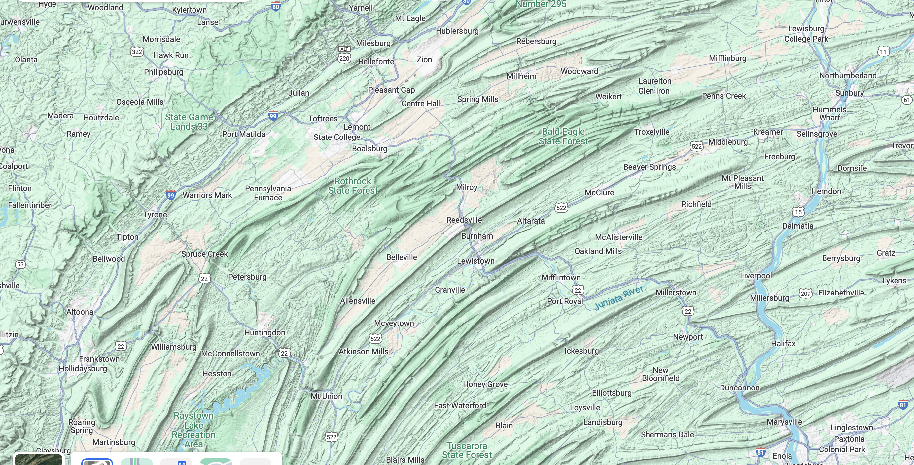
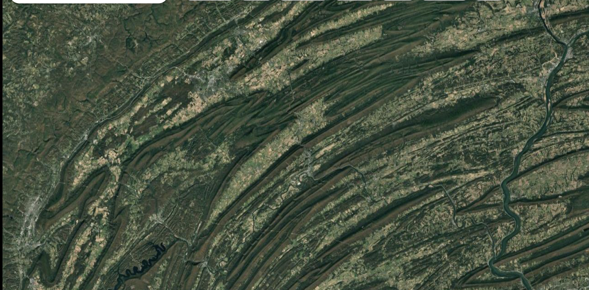

# Preliminaries

---

::: {#fig-pluto-charon-simulation width="80%"}



@Denton2025-bu
:::

## Last time...

- *Semiotics of data visualization*

## Symbol or thing symbolized?

:::: {.columns}
::: {.column width=50%}
{#fig-central-pa-map}
:::
::: {.column width=50%}
{#fig-central-pa-satellite}
:::
::::

## Today

- *Visualization in government & business*

## Goals

- Explore the landscape
- What types of visualizations?
- What types of data?
- Why visualize?

# Data visualization in government

## What data do governments collect?

- What data are collected?
- Primary sources
  - [Bureau of the Census](https://data.census.gov)
  - [Data.gov](https://data.gov)
  - [Open Data PA](https://data.pa.gov): 
https://data.pa.gov

## Data governments collect

- Secondary sources
  - <https://datausa.io/profile/geo/state-college-pa?redirect=true>

## Your turn...

::: {.question}
## Why do governments visualize data?
:::

::: {.fragment}
::: {.question}
## What data *should* governments visualize?
:::
:::

## Who benefits?

- Query to Google Chrome:"What U.S. businesses benefit from data collected and shared by the U.S. government?"
- [Results](https://www.google.com/search?q=What+U.S.+businesses+benefit+from+data+collected+and+shared+by+the+U.S.+government%3F&rlz=1C5GCCM_en&oq=What+U.S.+businesses+benefit+from+data+collected+and+shared+by+the+U.S.+government%3F&gs_lcrp=EgZjaHJvbWUyBggAEEUYOTIHCAEQIRiPAjIHCAIQIRiPAtIBCjE0OTA5ajBqMTWoAgiwAgHxBQPvLW7THSrz8QUD7y1u0x0q8w&sourceid=chrome&source=chrome.rb&ie=UTF-8)

# Data visualization in business

## What data do not-for-profit businesses visualize?

- [PSU Office of Planning, Assessment, and Institutional Research](https://opair.psu.edu/institutional-research/resources/)
- [Our World in Data](https://ourworldindata.org)
- [Gapminder](https://www.gapminder.org/)
  - [Dollar Street](https://www.gapminder.org/dollar-street)

## Your turn...

::: {.question}
## Why do businesses visualize data?
:::

# Work session

## Exercise 01

## Installing software

# Wrap-up

## Main points

- Governments collect & report on lots of data
- Non-profits collect varied types of data, and many visualize it
- For-profit business entities collect a ton of data, but most visualizations remain private

## Next time

- *Visualization in art, sports, and journalism*
- *Read* 
  - @Gelman2013-he (recommended), follow citation link to online version or [PDF on Canvas](https://psu.instructure.com/courses/2484925/files?preview=193922116).

# Resources

## References
