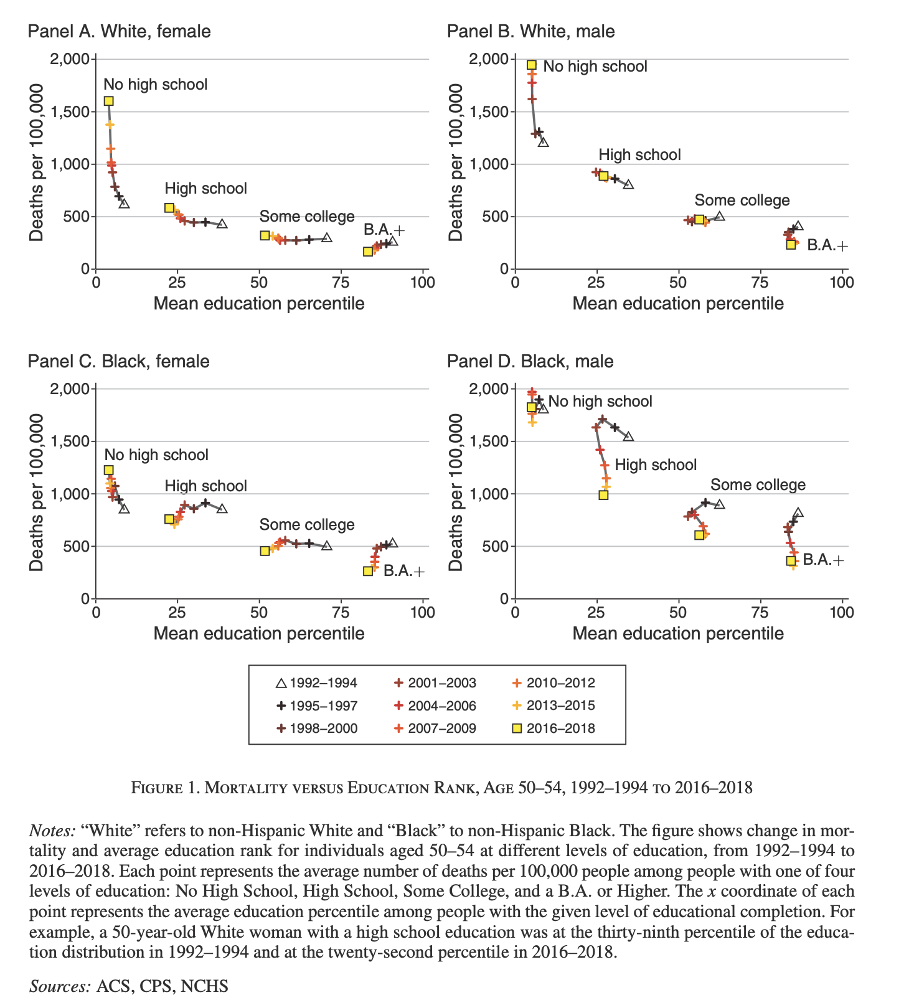
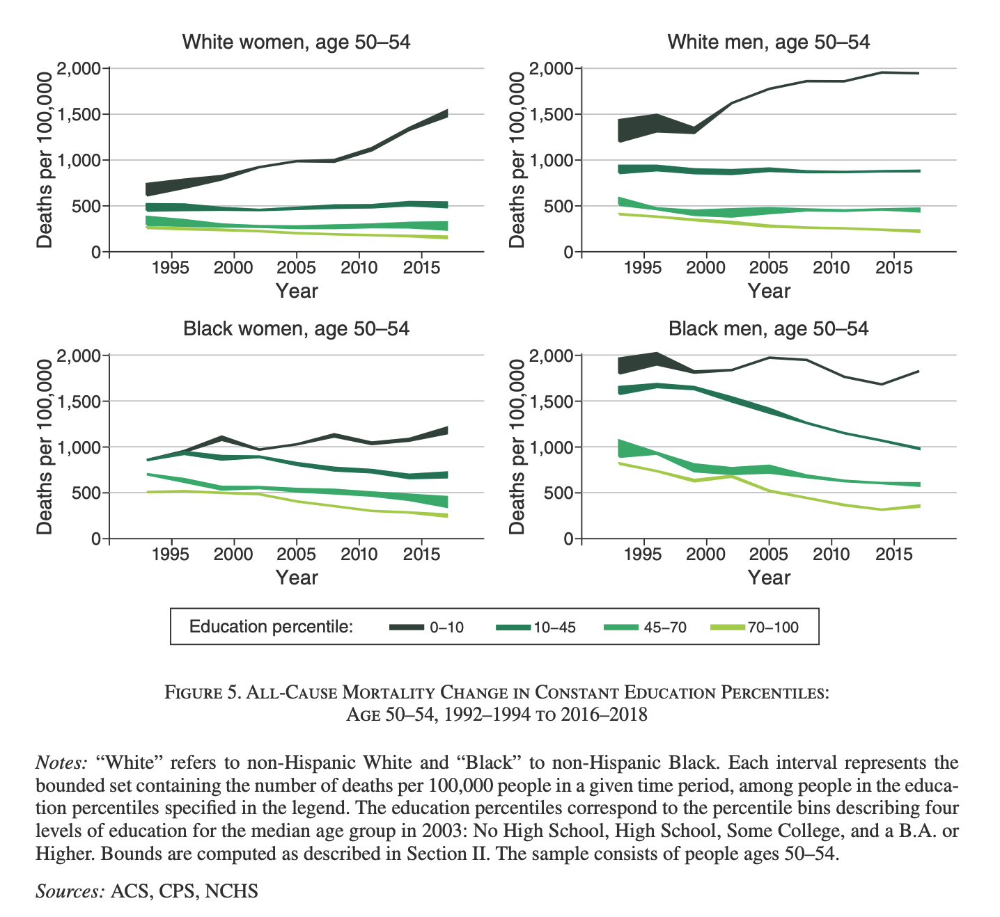
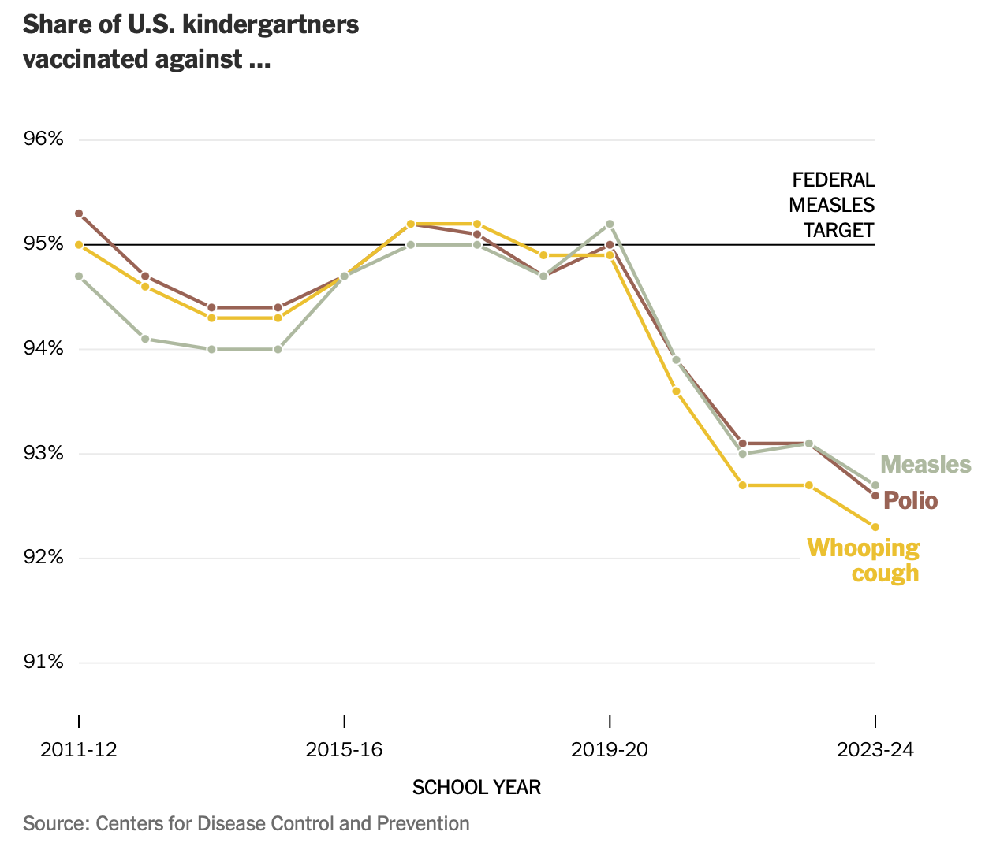
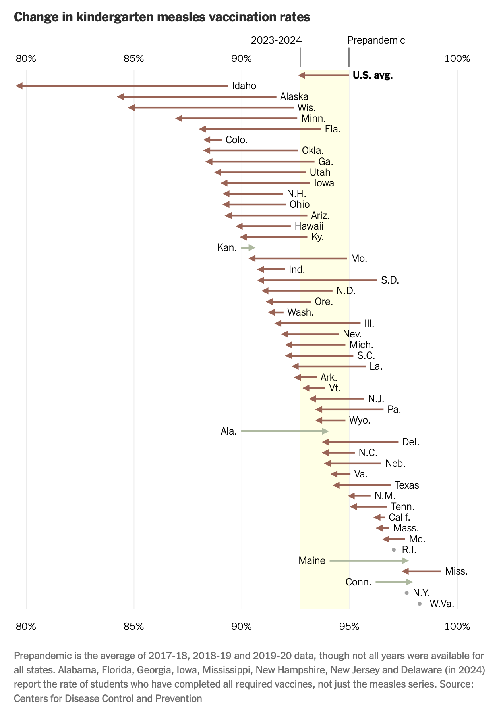
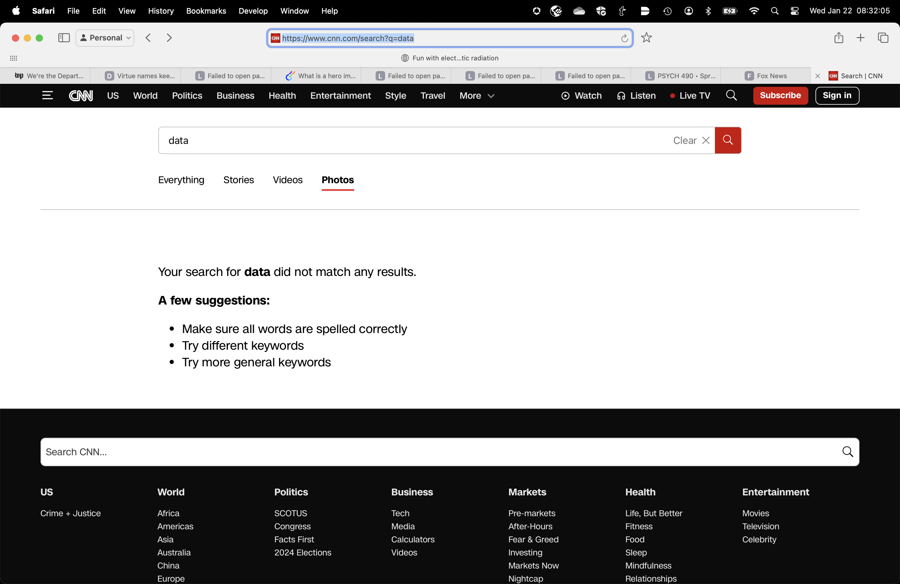
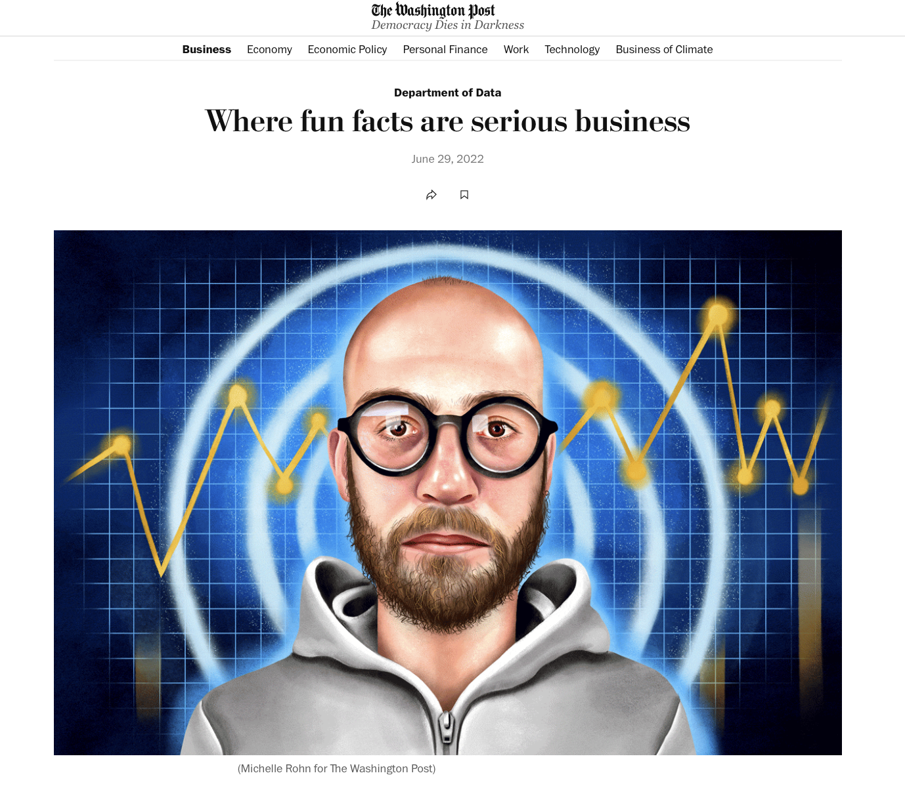
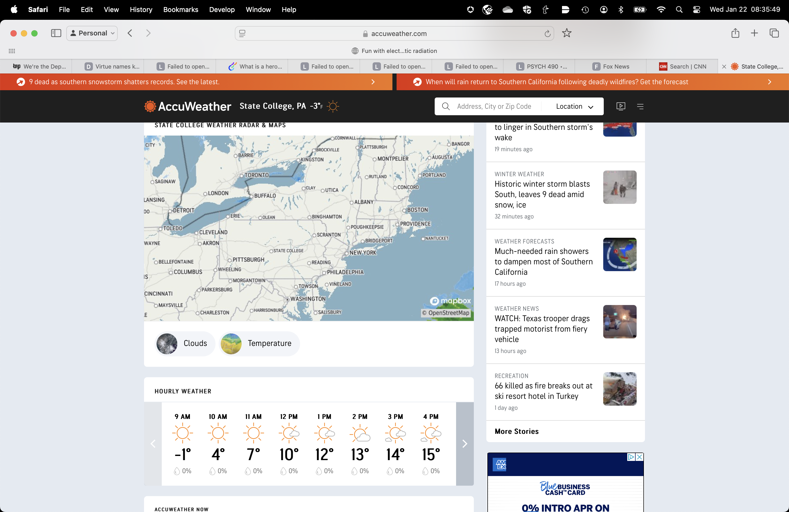

# Preliminaries

---



@Smalin2011-vr

## Mortality trends by education level

{#fig-mortality-trends width="40%"}

---

{#fig-mortality-trends-fig-05 width="50%"}

# Overview

## Announcements

- Due Friday: [Exercise 01](../exercises/ex-01-figs-in-psych-sci.qmd)

## Last time...

- *Visualization in government and business*

## Today

- *Visualization in art, sports, & journalism*

## Goals

- What sort(s) of visualizations are common in these fields?
- Apply principles of [semiotics](wk-01-2026-08-26-semiotics-data-viz.qmd#semiotics-of-data-visualization) to these visualizations.
  - Semantics: Mappings between signs and what they signify?
  - Syntax: Rules for arrangement/organization

# Data visualization in the arts

## Musical notation

{#fig-britannica-musical-notation}

## Antecdents

{#fig-musical-notation-antecedents}

---

{#fig-musical-annotation-antecedents-02}

## Hebrew trope

{#fig-hebrew-trope}

## Styles

- [Musical style guide](https://blogs.iu.edu/jsomcomposition/music-notation-style-guide/)

## What is being mapped?

- Pitch
- Timing, tempo
- Loudness
- Stylistic properties
- etc.

---

::: {#fig-beethoven-9th}
<iframe width="1240" height="450" src="https://www.youtube.com/embed/ljGMhDSSGFU?si=1I9C5vYt69rF21S1" title="YouTube video player" frameborder="0" allow="accelerometer; autoplay; clipboard-write; encrypted-media; gyroscope; picture-in-picture; web-share" referrerpolicy="strict-origin-when-cross-origin" allowfullscreen></iframe>

@Smalin2011-vr
:::

## Dance

::: {#fig-dance}
<iframe width="1240" height="450" src="https://www.youtube.com/embed/VQYuNKvbPDg?si=IsD5u5jYYENDZxkB" title="YouTube video player" frameborder="0" allow="accelerometer; autoplay; clipboard-write; encrypted-media; gyroscope; picture-in-picture; web-share" referrerpolicy="strict-origin-when-cross-origin" allowfullscreen></iframe>

@Flores2021-pt
:::

## Visual arts

 Champion](https://btaa.org/images/default-source/love-data-week/laura_guertin_thumbnail.webp?sfvrsn=a6a11c8d_1){#fig-btaa-data-viz-2024 width="30%"}

# Data visualization in sports

## Examples

- <https://operations.nfl.com/programs-initiatives/innovation/big-data-bowl>
- <https://www.tableau.com/sports-data>

# Data visualization in journalism

---

---

## Data journalism

- [The Economist](https://impact.economist.com/perspectives/search/infographic?f[0]=type%3Ainfographic&f[1]=)
- [The New York Times](https://www.nytimes.com/spotlight/graphics)

---

---

## The Washington Post

---

<iframe src="https://datawrapper.dwcdn.net/j4zy7/7/" width=100% height=80%></iframe>

@Fowers2024-hu

## Accuweather.com

## Knowable Magazine

- Graphics [library](https://www.flickr.com/photos/knowablemag/)

# Wrap-up

## Main points

## Data viz outside $\Psi$

- Non-science fields visualize data, too
- Multiple purposes/uses of data viz

# Next time

- Work session

# Resources

## References
