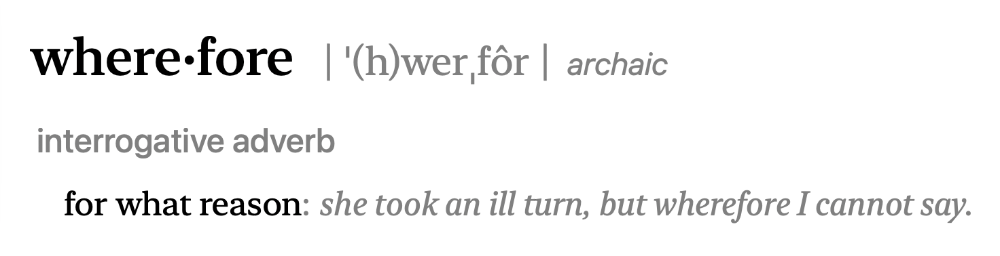

# Preliminaries

## Announcements

- Exercise 01 due today Friday, September 4, 2026 (midnight).
- Submit Quarto document to [ *Canvas dropbox* ](https://psu.instructure.com/courses/2484925/assignments/18448425)

## Today's topics

- Introducing Quarto
- Using Quarto for Exercise 02

# Introducing Quarto

## Wherefore Quarto

{#fig-wherefore}

## Quarto

- System for creating documents, reports, and dashboards
- Combine text, figures, code, links, video, equations
- Write in text $\rightarrow$ render to html, pdf, docx, pptx and more

## Installing Quarto

{#fig-installing-quarto}

# Your turn

## Create New Project

:::: {.columns}
::: {.column width=50%}
{fig-align="center" #fig-file-menu-new-project}
:::
::: {.column width=50%}
{fig-align="center" #fig-new-project-project-manager width="60%"}
:::
::::

---

{#fig-create-project-new-directory width="75%"}

---

{#fig-create-project-type-quarto width="75%"}

---

{#fig-create-project-quarto-name width="75%"}

---

::: {.callout-important}
## Learn from expert practices
- Establish a clear file/project scheme
  - Stick with it
  - I use: `~/rrr/psych-490-exercise-01`
  - Why? Someone who knows more than I do suggested it.
- No spaces in files and folder/directory names
- Put info in file/folder name: `psych-490-exercise-01`
:::

## Explore project (and document)


## Anatomy of Quarto document

:::: {.columns}
::: {.column width=40%}
- Text, has `.qmd` extension
- Metadata^[Data about data.] information (b/w pairs of `---`)
- Section headers
  - `##` means a 2nd level header
- Code chunks!
:::
::: {.column width=60%}
{#fig-exercise-01-file align="right"}
:::
::::

## *Render* the file

- Turn the text file into something else
  - Webpage (HTML)
  - Document (PDF, Word)
  - Slides
- Default is webpage (HTML)
- I recommend checking "Render on Save"

## Rendered file


## Under the hood (1 of 3)

:::: {.columns}
::: {.column width=50%}
- File metadata are at the top between rows of triple dashes `---`
  - Add a subtitle: `subtitle: "Friday, September 4, 2026"`
- Clickable web links are surrounded by `<` and `>`
:::
::: {.column width=50%}

:::
::::

## Under the hood (2 of 3)

:::: {.columns}
::: {.column width=50%}
- Custom web link labels require this syntax: `[Penn State home page](https://psu.edu)`
  - Label is inside square brackets `[]`
  - URL inside parentheses `()`
  - Renders to: [Penn State home page](https://psu.edu) 
:::
::: {.column width=50%}

:::
::::

## Under the hood (3 of 3)

:::: {.columns}
::: {.column width=50%}
- Code in chunks marked by triple backticks "```"
- Chunk says what language to use in curly braces: `{r}`
  - Could be other languages Quarto supports
:::
::: {.column width=50%}

:::
::::

# Work on Exercise 02

## Visit the template

- Visit <https://github.com/psu-psychology/psych-490-data-viz-2026-fall/blob/main/exercises/ex-01-template.qmd>

## Copy the template text into a new text file

- Click inside the text window.
- Select the text (highlight it)
- Switch to RStudio, create a new *text* file
- Paste the text
- Save the file as `exercise-01-template.qmd`

## Render the template {.scrollable}

{#fig-rendered-ex-01-template}

## More under the hood (1 of 3)

- Metadata has an `author field. Change this in your document.
- Change `title` to `Exercise 02`.
- Change `About` section to reflect goals of Exercise 02.

## More under the hood (2 of 3)

- Figures use this syntax: ``
  - Similar to web link, but note initial exclamation point (`!`)
  - ``
    - Link to figure can be URL or path to file (`path/to/my_figure.jpg`)
    
## More under the hood (3 of 3)

- Quarto converts Quarto file into HTML or PDF or...
- Writing and reading Quarto should be easier than writing HTML
- Quarto bundles other tools

# Wrap-up

## Next time

- *Making (sense of) data*
- *Read*: 
  - @Stevens1946-sh | [PDF on Canvas](https://psu.instructure.com/courses/2484925/files?preview=193582608)
  - @Wikipedia-contributors2024-xu (Optional)
  - @Tourangeau2012-fr | [PDF on Canvas](https://psu.instructure.com/courses/2484925/files?preview=193582611). (Optional)

# Resources

## About

This talk was produced using [Quarto](https://quarto.org), using the [RStudio](https://posit.co/products/open-source/rstudio/)
Integrated Development Environment (IDE), version 2026.1.0.392.

The source files are in R and R Markdown, then rendered to HTML using the
[revealJS](https://revealjs.com) framework.
The HTML slides are hosted in a [GitHub repo](https://github.com/psu-psychology/psy-511-scan-fdns-2026-spring) and served by GitHub pages:
<https://psu-psychology.github.io/psy-511-scan-fdns-2026-spring/>

## References