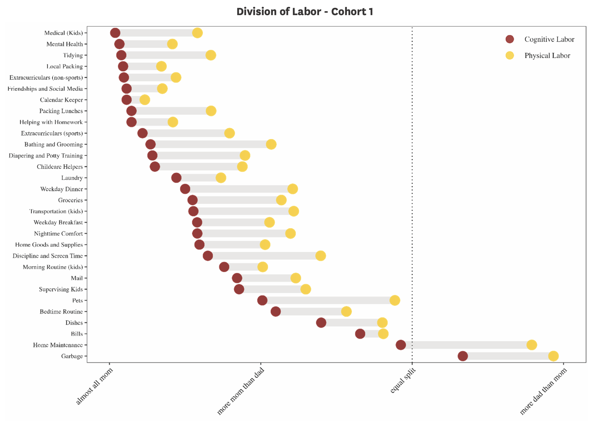
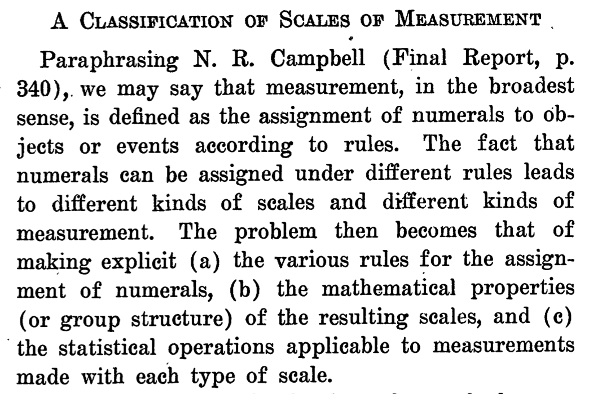
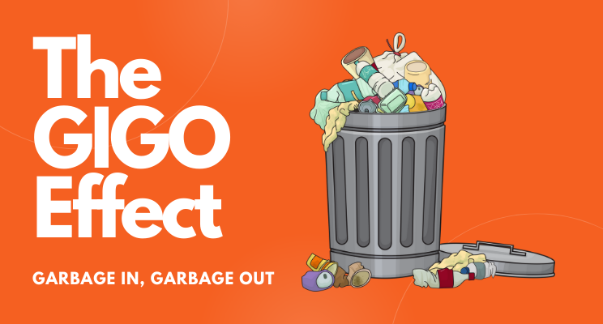
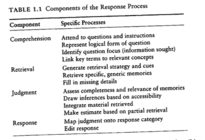
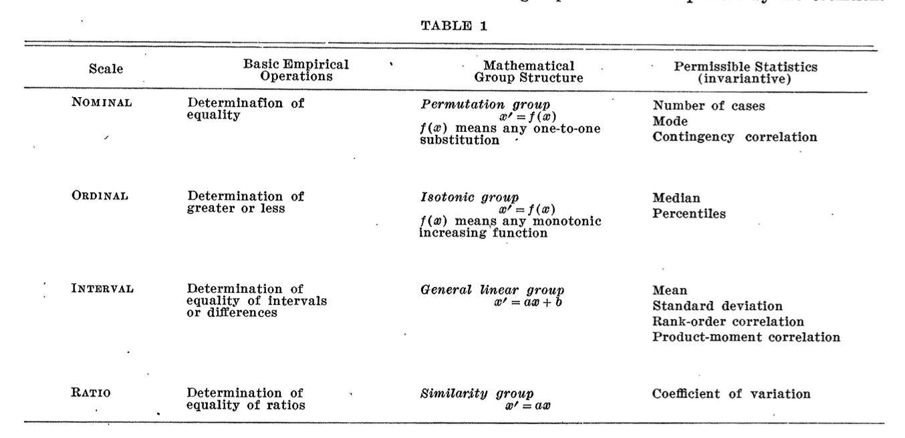

# Preliminaries

---

{#fig-antibiotics width="60%"}

## Announcements

- [Exercise-02](../exercises/ex02-data-viz-outside-psych.qmd) write-up [due Thursday, January 30](../schedule.qmd#thursday-january-30){.orange_due}.

## Last time...

- Introducing Quarto
- *Visualization in the arts, sports, & journalism*

## Your turn

::: {.question}
## Are there characteristic features of data visualizations in different fields?
:::

## Preliminary findings

- Visualization of Exercise 01
- [Visualization](../supplemental/other-field-figs.qmd) of [Exercise 02](../exercises/ex02-data-viz-outside-psych.qmd) results

## Today

- Making Data
- Types of data

# Making Data

---

>Data are made, not born.

Gilmore 2025

---

>No one really knows how the game is played... \
>The art of the trade \
>How the sausage gets made \
>We just assume that it happens \
>But no one else is in the room where it happens

"The Room Where it Happens", Leslie Odom Jr. and Lin-Manuel Miranda, "Hamilton"

## How are data made?

>- By measurement

---

{#fig-history-of-measurement}

---

{#fig-measurement-guide width="65%"}

## What is measurement?

>- A *procedure for mapping* properties of X onto some numerical standard or scale Y
>- [*Metrology*](https://en.wikipedia.org/wiki/Metrology): The science of measurement
>- [*Psychometrics*](https://en.wikipedia.org/wiki/Psychometrics): The study of psychological measurement

## Why 'mapping'?

:::: {.columns}
::: {.column width=50%}
```{mermaid}
%%| label: fig-measurement-mapping
%%| fig-cap: "Illustration of a mapping from observed entity to data"
flowchart TB
  A[Thing/Person]-- Procedure  -->B(Instrument)
  B --> C{Data}
```
:::
::: {.column width=50%}
```{mermaid}
%%| label: fig-measurement-mapping-2
%%| fig-cap: "Illustration of multiple mappings from an observed entity to data"
flowchart TB
  A[Thing/Person]-- Procedure  -->B(Instrument)
  A[Thing/Person]-- Procedure-2  -->C(Instrument-2)
  B --> E{Data}
  C --> D{Data-2}
```
:::
::::

## Procedures are

- Sequences of behaviors

## Data ~ quantitative terminology

- Data a *symbol* of the thing measured, not the thing itself
- E.g., words are a *symbol* of the things they refer to

```{mermaid}
%%| label: fig-semantic-mapping
%%| fig-cap: "Mapping from concept/entity to a word."
flowchart TB
  A[Cute animal with fur that purrs] --> B('cat')
  A ---> C('gato')
  A ---> D('chatte/chat')
  A ---> E('猫')
```

## Symbols reflect, select, and deflect

>Even if any given terminology is a *reflection* of reality, by its very nature as a terminology, it must be a *selection* of reality; and to this extent must also as a *deflection* of reality

@Burke1968-ye

## What is 

:::: {.columns}
::: {.column width=50%}
- reflected, selected, deflected?
:::
::: {.column width=50%}

:::
::::

---

{#fig-aviv-etal width="60%"}

## Stevens' scales of measurement

{#fig-stevens-1946 width="65%"}

## Questions about measurement

- What's the procedure for making this mapping?
- What are the rules for assigning numbers/categories?
- What can we do with the assigned numbers (summarize, depict)?

## Why does measurement matter?

{#fig-gigo}

# Types of data

## In other domains

- Business/economics
- Politics
- Sports
- Entertainment
- Weather

## In psychology

- Internal mental states
- Behaviors
- Physiological processes
- Physical characteristics
- Environmental properties

## Examples of...

- Internal mental states
- Behaviors
- Physiological processes
- Physical characteristics
- Environmental properties

## How to measure...

- Internal mental states
- Behaviors
- Physiological processes
- Physical characteristics
- Environmental properties

## Psychology of survey response

{#fig-tourangeau-2012}

## Scales of measurement

{#fig-stevens-table-01}

# Wrap-up

## Main points

- Data are *made*
  - Map characteristics to quantities
  - By some measurement procedure
  - Reflect, but also select and deflect
- Mappings have different scale types [@Stevens1946-sh]
- Scales determine i) permissible/logical stats & ii) best visualizations

## Next time

- *Work session: Making data with R*
- [Exercise 02](../exercises/ex-02-data-viz-outside-psych.qmd)

# Resources

## References
