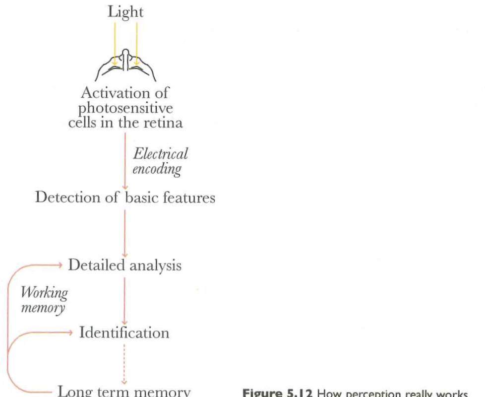
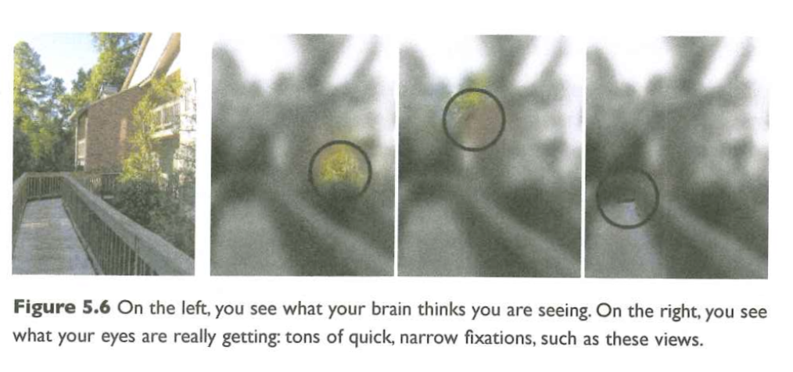

# Preliminaries

## Last week...

- [*ggplot2* tutorial I](../tutorials/tutorial-ggplot2-I.qmd)
- Figure types

## Today's topics

- What is vision for?s
- Information in light
- Detecting information in light

# What is vision for?

## Information at a distance

{#fig-web-deep-field width="70%"}

## Nature's speed demon/speed limit

- Light (+ radiowaves) circumnavigate the Earth in ~133 ms

{width="35%" #fig-field-day-2025-w3tm}

- Earth ~8.3 light-minutes from the Sun

## Where is it/am I?

::: {.incremental}
- Azimuth (left/right)
- Elevation (up/down)
- Distance (near/far)
- Orientation
:::

## What is it?

::: {.incremental}
- Edges $\rightarrow$
- Surfaces $\rightarrow$
- Objects or entities
:::

## Regarding data figures...

- *What* are the figure components
  - Data points, text, bars/segments/rings/boxes
- *Where* are different components relative to one another, axes, etc.
- *How* do figure components convey information about data?

# Information in light

---

{#fig-cairo-5.12 width="65%"}

## Electromagnetic spectrum

{#fig-em-spectrum-wikipedia width="75%"}

## Surfaces reflect/absorb or emit

{#fig-surface-reflection width="60%"}

## Different surfaces == Different reflection/absorption

- Perceived color differences correspond to different patterns of light reflection.

## Artificial sources



## Spatial patterns on retina

- depend on object geometry and orientation

{#fig-retinal-projection}

---

{#fig-same-projection-angle}

# Detecting information in light

## What information?

- Position
- Length
- Area
- Color
- Texture
- (Motion)

## The eye

{fig-align="center" #fig-the-eye}

## is like an auto-focus, auto-exposure camera...

{#fig-eye-autofocus-camera fig-align="center"}

## part of a self-stabilizing system...



@Bucalo2015-qm

## Eye + head + body system

::: {.callout-note}
- Eye + head + body movements *align and point* the eyes
- Eye + head + body movements *stabilize* the eyes
  - When the observer moves
  - When objects move
:::

## Demo

- May I have a volunteer?

## Image formation

- Eye's optical components
  - Cornea (fixed refraction)
  - Iris/pupil (*modifiable* aperture)
  - Lens (*modifiable* refraction) 
- Create projection (image) on retina

## The retina...

{fig-align="center" #fig-the-retina}

- samples spatial patterns of light intensity & wavelength patterns

## 'Wavelength-tuned' photoreceptors

![Wikipedia^[By BenRG - Own work, Public Domain, https://commons.wikimedia.org/w/index.php?curid=7873848]](https://thumb.wikimedia.org/wikipedia/commons/thumb/0/04/Cone-fundamentals-with-srgb-spectrum.svg/3840px-Cone-fundamentals-with-srgb-spectrum.svg.png?utm_source=en.wikipedia.org&utm_campaign=imageinfo&utm_content=thumbnail){#fig-cone-photoreceptors width="60%"}

---

{#fig-rods-cones}

---

### ...arranged in mosaics

{#fig-cone-rod-mosaics}

---

### with different concentrations in different parts of the retina

## Consequences

- Must move eyes to position highest resolution part of retina over target
- Keep track of sequence of eye movements and positions over time
- Integrate sequence of samples over time

---

## Information processing

- Separate channels for short, medium, long wavelengths (cones): chromatic (color)
- Black/gray/white or overall illumination (rods): achromatic (dark/light)
- ~120 M rods + ~ 5 M cones (125 M) vs. professional cameras with 100 M pixels

---

- Point by point, topographic (map-like) 2D image of 3D world
- Non-uniform resolution (center >> periphery)
- yields focused image except...

---

### ...when eye misshapen for cornea  +lens

## Acuity 

- Detail/pattern vision
- Grating acuity
- Vernier
- Symbol/letter (optotype) acuity

---

<!-- Measuring visual acuity HOTV and Lea symbols -->

{fig-align="center"}

## Contrast sensitivity

- Light/dark ratio (contast)
- vs. spatial frequency (level of detail)
- Contrast -> edges; edges -> shape/form
- e.g., driving in fog

---

---

## Color perception

- Perceived color a function of activity in "R", "G", and "B" photoreceptors

## Wavelengths are continuous, but are perceived colors?

## Perceived colors seem ordinal, but...

- Color is a neuropsychological construct

## Color vision anomalies

- Absence of or anomalies in photoreceptors

## Types

:::: {.columns}
::: {.column width=40%}
- Protanopia (impaired R/long wavelength)
- Deuteranopia (impaired G/medium wavelength)
- Tritanopia (impaired B/short wavelength)
:::
::: {.column width=60%}

:::
::::

## Color palettes

## Some consequences for data figures

- Size of visual elements (symbols, including text)
- Contrast (light/dark or color)
- Textures of visual patterns
- Some colors more visible than others
  - [Vischeck](https://www.vischeck.com/)
- How much visual scanning (# of eye movements)?

## Your turn

::: {.callout-important}
## Evaluating figures

- Visit our sample figures [page](../tutorials/tutorial-making-data.qmd) and evaluate which figures might pose challenges for people with vision impairments.
- Visit our figures in [psychological science](../supplemental/psych-sci-figs.qmd) and figures in [business, journalism, and the arts](../supplemental/other-field-figs.qmd) pages with the same goal.
- What specific issues do you foresee?
:::

# Main points

---

- Visual perception a *reconstruction* of reality
- Continuous pattern of light $\rightarrow$ intensity detected by 4 photoreceptor types
- Retina has non-uniform sensivity to light, so some information more easily detected

# Next time

*From cognition to understanding*

# Resources

## References
