# Prelude

## Announcements

- Exercise 03 due this Friday.

## Last week...

- Light informs
  - *Spatial* perception: Where, how far, how big?
  - *Object* perception: What is it, what form, color, etc.
- Eye
  - High resolution info only in center
  - Samples different categories of light wavelength
  - Moves to stablize retina, scan environment
  
---

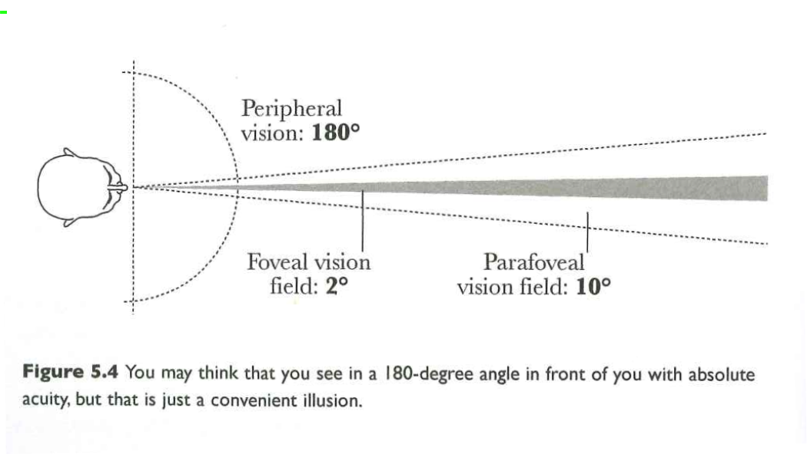{#fig-cairo-5.4 width="75%"}

---

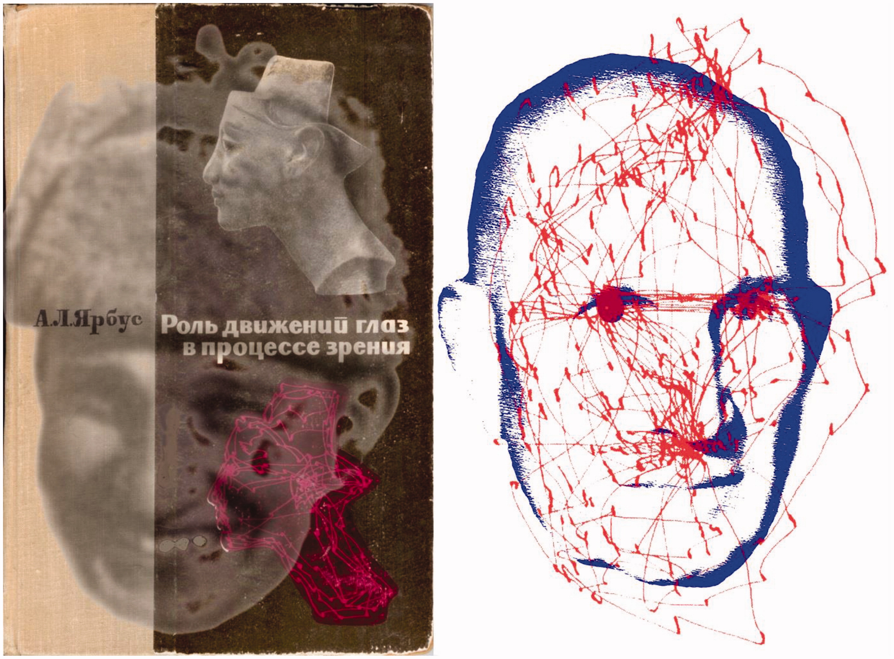{#fig-yarbus  width="75%"}

## Today

- Wrap-up on sensation
- From sensation to perception

# Wrap-up on sensation

## Color perception

:::: {.columns}
::: {.column width=50%}
- Perceived color a function of activity in "R", "G", and "B" photoreceptors
:::
::: {.column width=50%}
](https://thumb.wikimedia.org/wikipedia/commons/thumb/1/1e/Cones_SMJ2_E.svg/3840px-Cones_SMJ2_E.svg.png?utm_source=en.wikipedia.org&utm_campaign=imageinfo&utm_content=thumbnail){#fig-wikipedia-color-sensitivity}
:::
::::

## Wavelengths are continuous, but are perceived colors?

{#fig-wavelengths}

## Perceived colors seem ordinal, but...

{fig-align="center" #fig-color-wheel width="35%"}

## Color is a *neuropsychological* construct



## Color vision anomalies

:::: {.columns}
::: {.column width=50%}
- Absence of or anomalies in photoreceptors
:::
::: {.column width=50%}
{#fig-wong-2011-fig-01}
:::
::::

## Types

:::: {.columns}
::: {.column width=40%}
- Protanopia (impaired R/long wavelength)
- Deuteranopia (impaired G/medium wavelength)
- Tritanopia (impaired B/short wavelength)
:::
::: {.column width=60%}
{#fig-color-blindness-types}
:::
::::

## Color palettes

{#fig-color-palettes}

## Some consequences for data figures

- Size of visual elements (symbols, including text)
- Contrast (light/dark or color)
- Textures of visual patterns
- Some colors more visible than others
  - [Vischeck](https://www.vischeck.com/)
- How much visual scanning (# of eye movements) required?

# From sensation to perception

## Visual brains love *differences* {.scrollable}

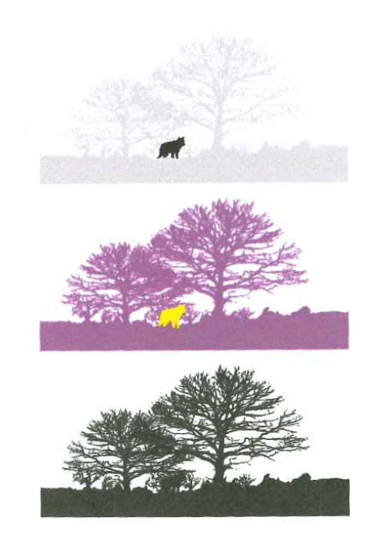{#fig-cairo-6.1 width="75%" fig-align="center"}

## Especially ...

:::: {.columns}
::: {.column width=50%}
- Intensity (light/dark)
    - Contrast
- Color
- Position or size
- Changes in...
:::
::: {.column width=50%}
{width="55%" #fig-kahneman-fast-slow}
:::
::::

## Pre-attentive vision

- Detect quickly, with minimal effort
- Usually in a single glance/fixation
- vs. *attentive* vision
    - Overt shifts of attention (eye movements)
    - Covert shifts ("mind's eye" movements)
    
---

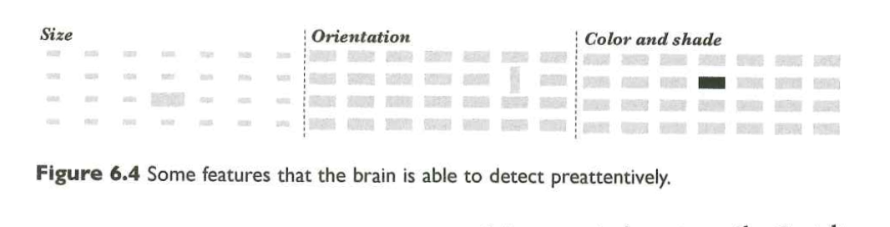{#fig-cairo-6.4}

## Some features easier/faster to judge {.scrollable}

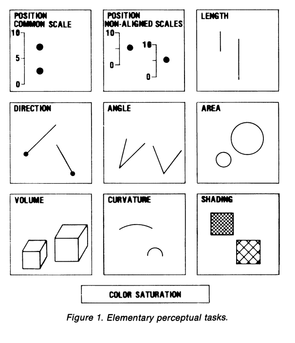{#fig-cleveland-1984}

## {.scrollable}

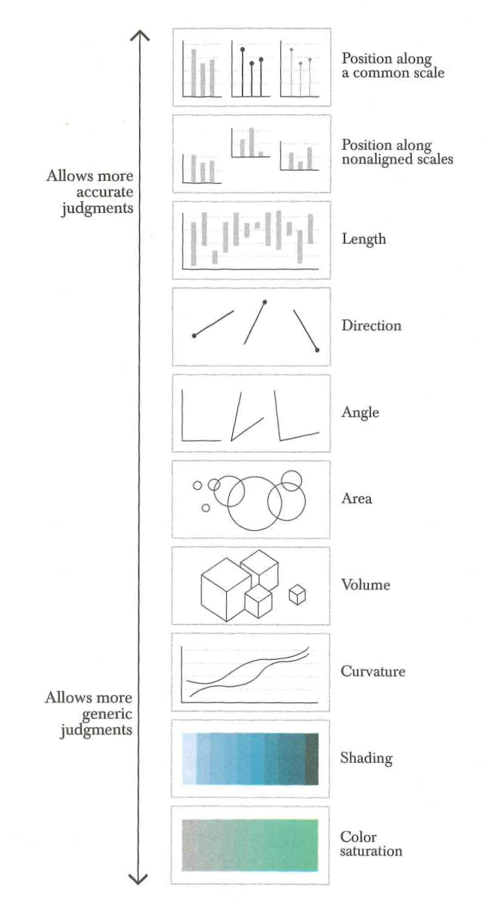{#fig-cairo-6.12}

## Gestalt school

- Gestalt: "whole form"
- Can psychological phenomena be understood from their parts?
- Or is the whole greater than the sum of the parts?

## Reification

:::: {.columns}
::: {.column width=40%}
- Perception is *constructive*
:::
::: {.column width=60%}
{#fig-reification}
:::
::::

---

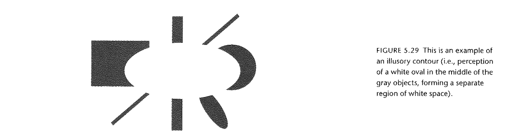{#fig-few-5.29}

## Multistability {.scrollable}

:::: {.columns}
::: {.column width=40%}
- Perception is *multistable*
:::
::: {.column width=60%}
](https://thumb.wikimedia.org/wikipedia/commons/thumb/5/51/Optical_Illustion-Ambiguous_Patterns.svg/500px-Optical_Illustion-Ambiguous_Patterns.svg.png?utm_source=en.wikipedia.org&utm_campaign=imageinfo&utm_content=thumbnail){#fig-gestalt}
:::
::::

## Invariance

:::: {.columns}
::: {.column width=40%}
- And yet...
- Perception is *invariant*
:::
::: {.column width=60%}
{#fig-invariant}
:::
::::

## Gestalt "laws" of perceptual grouping

- Proximity
- Similarity
- Connectedness
- Closure
- Continuity
- Symmetry

## Proximity

{#fig-gestalt-laws}

---

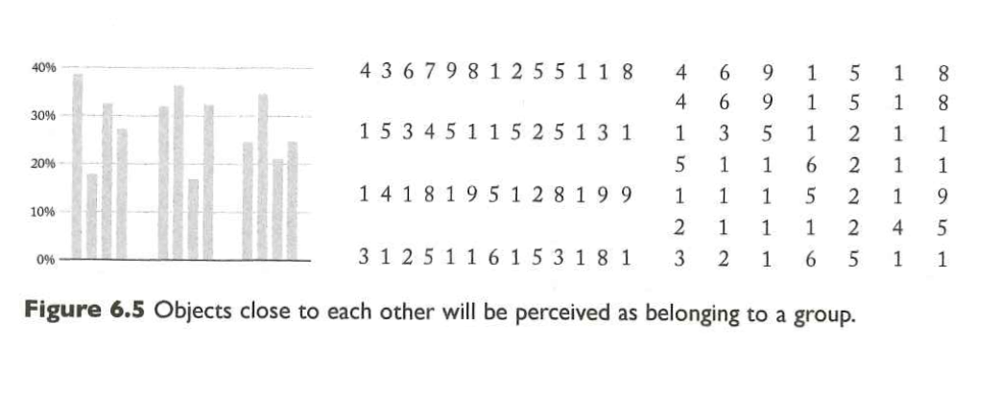{#fig-cairo-6.4}

## Similarity

](https://thumb.wikimedia.org/wikipedia/commons/thumb/8/8f/Gestalt_similarity.svg/1920px-Gestalt_similarity.svg.png?utm_source=en.wikipedia.org&utm_campaign=imageinfo&utm_content=thumbnail){#fig-similarity}

---

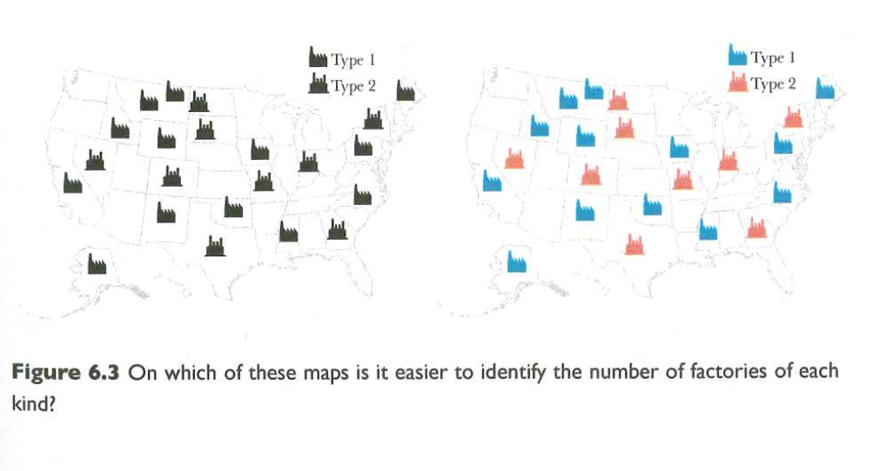{#fig-cairo-fig-6.3}

## Similar but not *too* similar

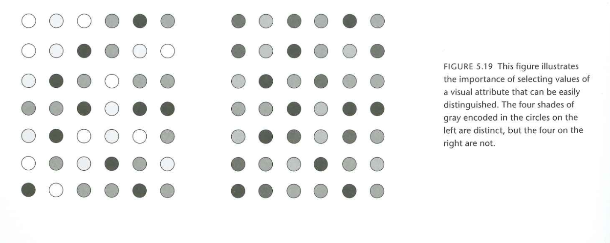{#fig-cairo-5.19}

## Closure

{#fig-gestalt-closure}

## Continuity

](https://upload.wikimedia.org/wikipedia/commons/6/60/CrossKeys.png?utm_source=en.wikipedia.org&utm_campaign=imageinfo&utm_content=thumbnail_unscaled){#fig-gestalt-continuity width="55%"}

---

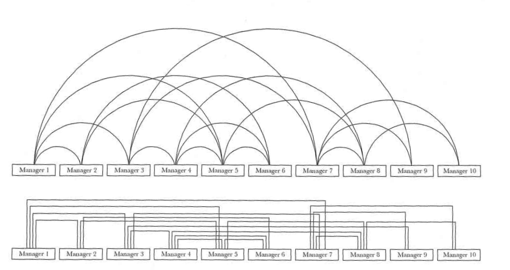{#fig-cairo-6.9}

---

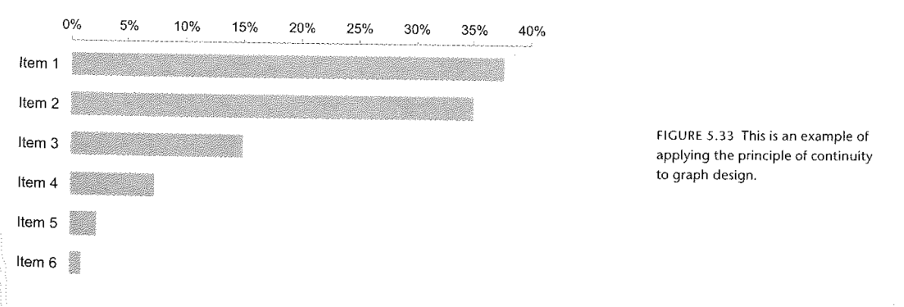{#fig-few-5.33}

## Connectedness

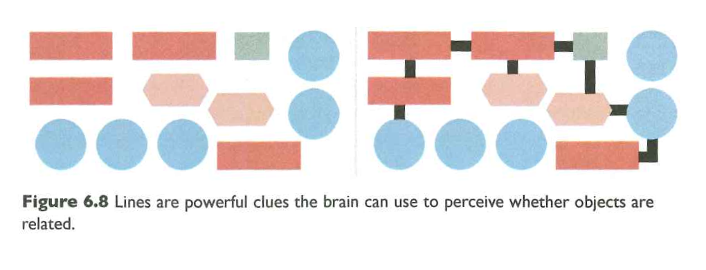{#fig-cairo-6.8}

---

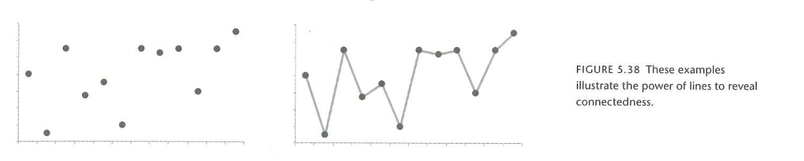{#fig-few-5.38}

## Symmetry

{#fig-gestalt-symmetry}

---

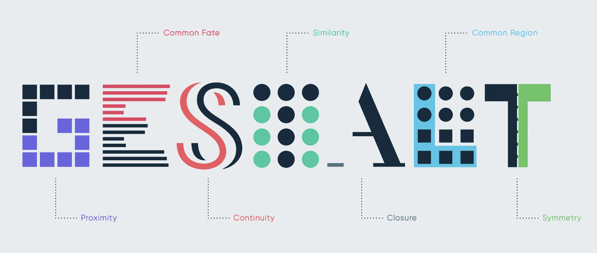{#fig-gestalt-principles-in-ui}

## Final Project idea

- Find several compelling illustration of one or more of the Gestalt phenomena (non-data visualization-related)
- Find illustrations of the same Gestalt phenomena in a data visualization OR
- Generate figures that reflect the phenomena

## Putting it all together {.scrollable}

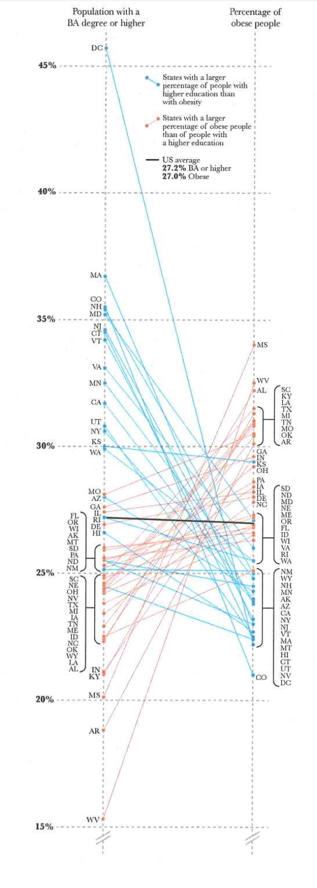{#fig-cairo-6.20 fig-align="center"}

# Wrap-up

## Main points

- Vision is *reconstructive*
- Pre-attentive vs. attentive vision
- Gestalt principles describe feature grouping

## Next time

- *From cognition to understanding*

# Resources

## References
