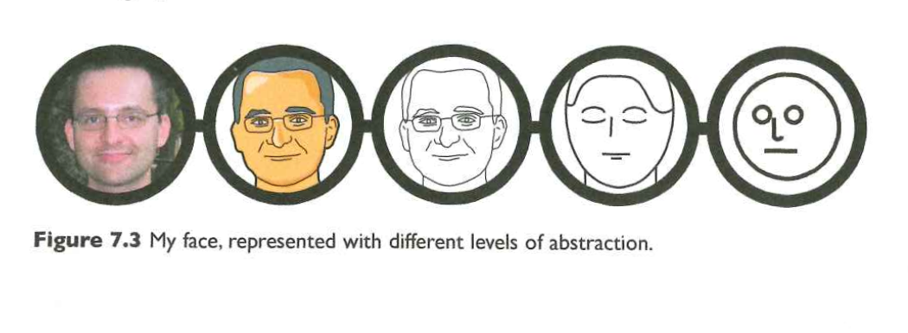
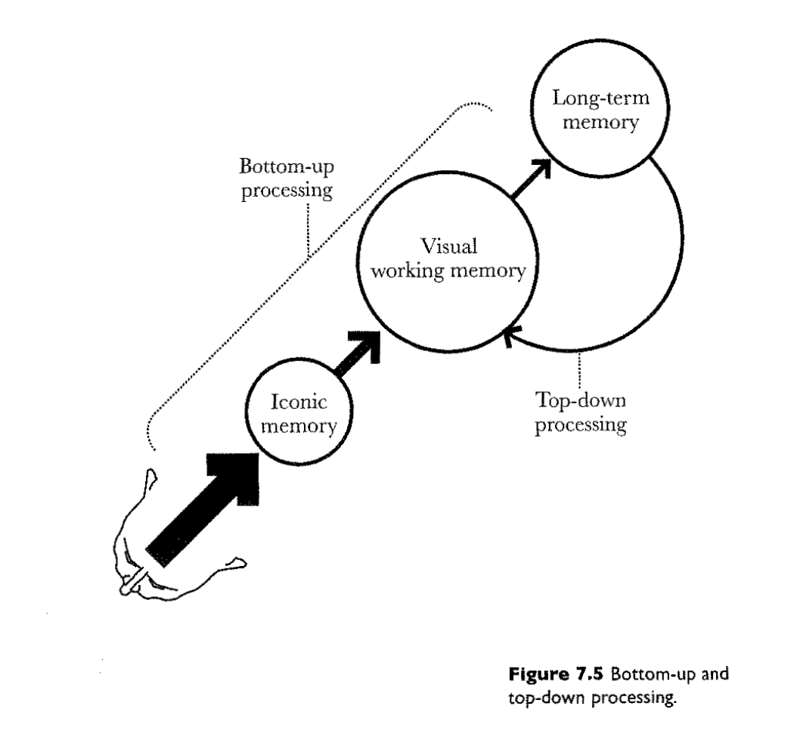
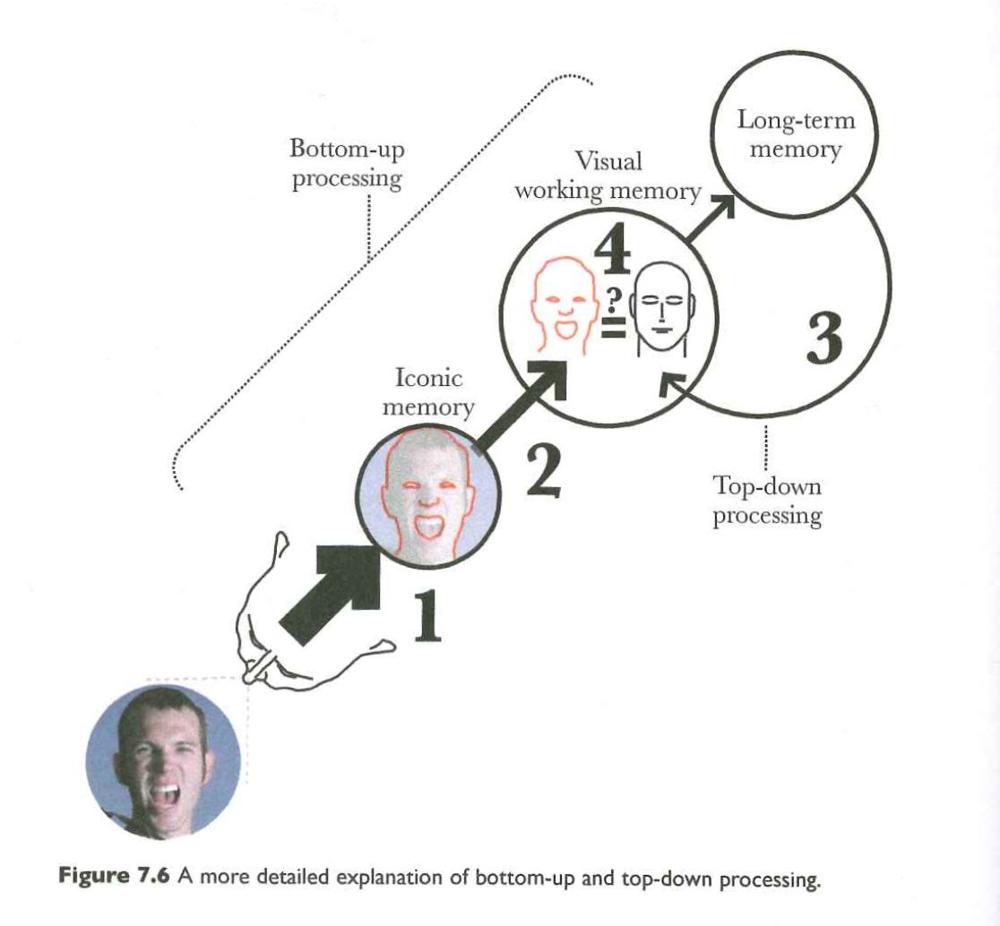
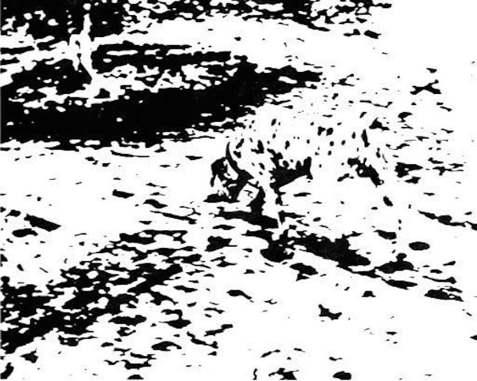
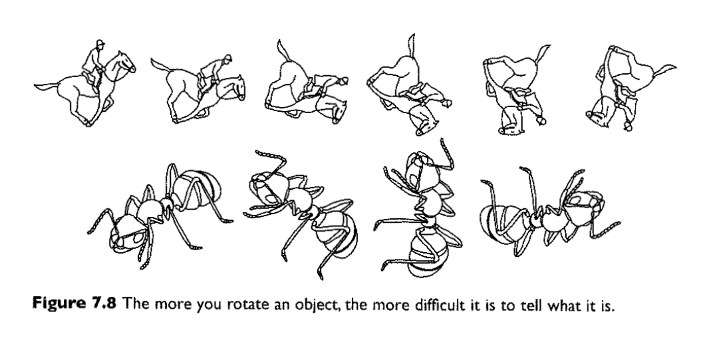
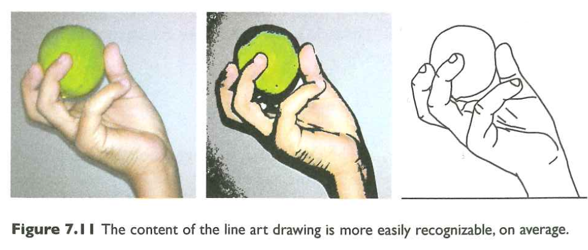
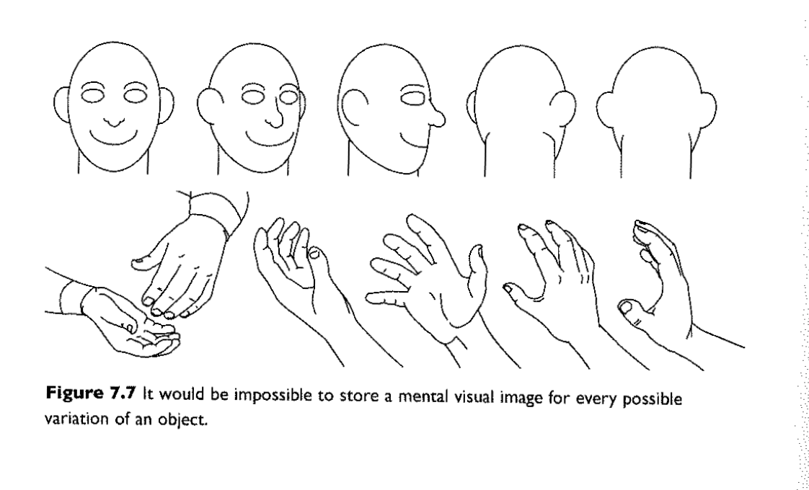
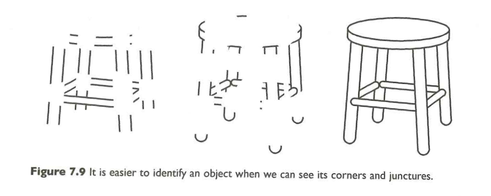
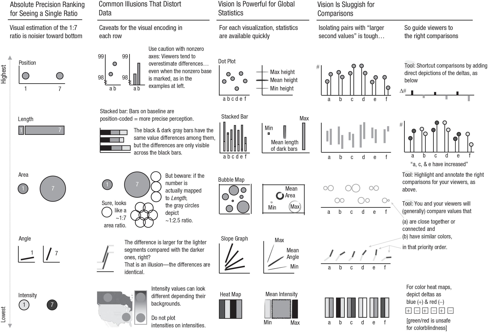
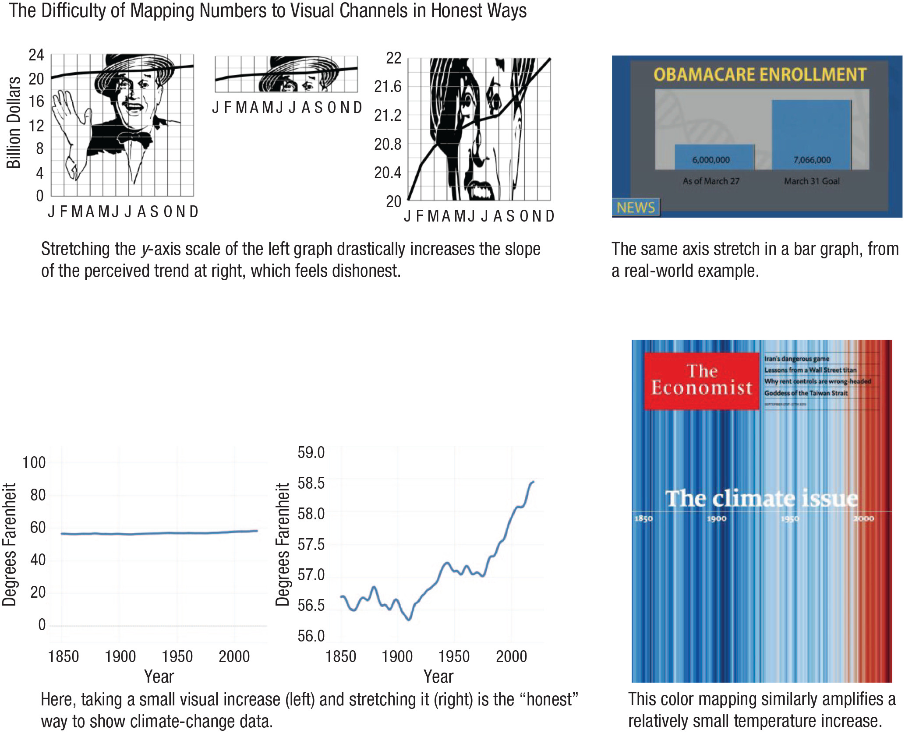

# Overview

## Announcements

- [Assigned]{.green_assigned} today: [Final Project](../exercises/final-project.qmd) proposal

## Last time...

- Pre-attentive vs. attentive vision
- Gestalt principles

## Today

- Wrap up on Gestalt principles
- From specifc to general; concrete to abstract

# Wrap up on Gestalt principles

## Last time...

- Link to 2026-09-28 [slides](wk-06-sensation-to-perception.qmd#closure)

# From specific to general; concrete to abstract

## From specific to general



## Bottom-up and top-down {.scrollable}

{#fig-cairo-7.5}

## {.scrollable}

{#fig-cairo-7.6}

---

{#fig-dalmation width="70%"}

## How large is the memory bank?

{#fig-cairo-7.8}

## When less detail > more

{#fig-cairo-7.11}

## Abstraction to the rescue

{#fig-cairo-7.7 width="70%"}

## Some parts > others

{#fig-cairo-7.9}

## Back to visualizations 

>"Visualizations let viewers see beyond summary statistics."

-- @Franconeri2021-uv


---

```{r}
#| label: fig-datasaurus-dozen
#| fig-cap: "The DatasauRus dozen [@datasaurus2019-us; @Matejka2017-xi; @datasauRus]"
library(datasauRus)
library(ggplot2)
library(gganimate)

ggplot(datasaurus_dozen, aes(x=x, y=y))+
  geom_point()+
  theme_minimal() +
  transition_states(dataset, 3, 1) + 
  ease_aes('cubic-in-out')
```

## Not all plots are equivalent


---

>"Visual channels translate numbers into images"

-- @Franconeri2021-uv

---

{#fig-franconeri-fig-02 width="75%"}

## Hard to map without distortion

{#fig-franconeri-fig-03 width="60%"}

# Wrap-up

## Next time

- Work session: Visualizing sports data from the `nflreadr` package

# Resources

## References
