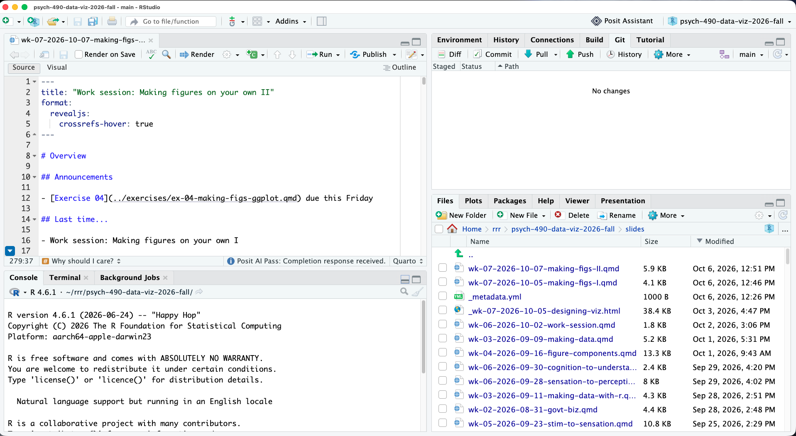
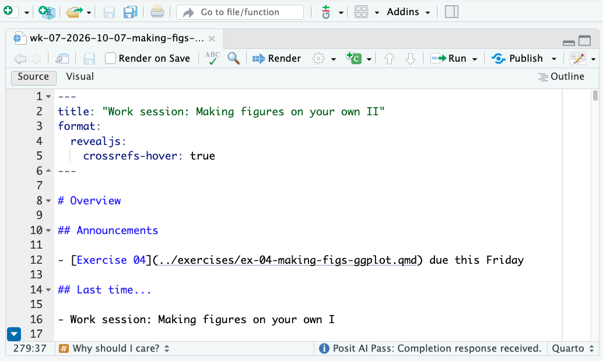
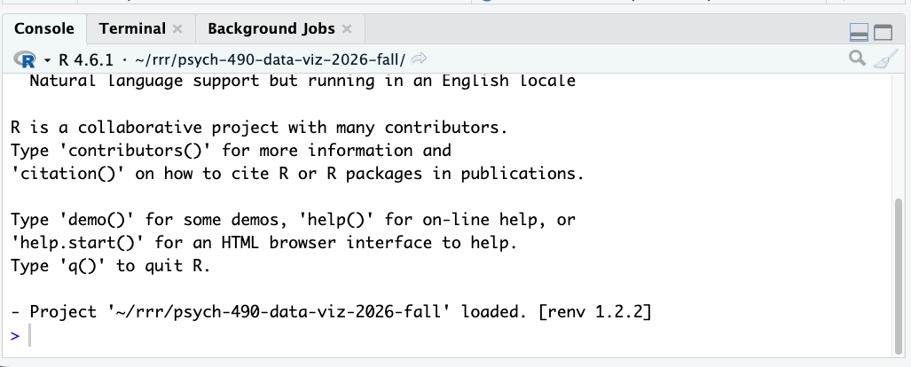
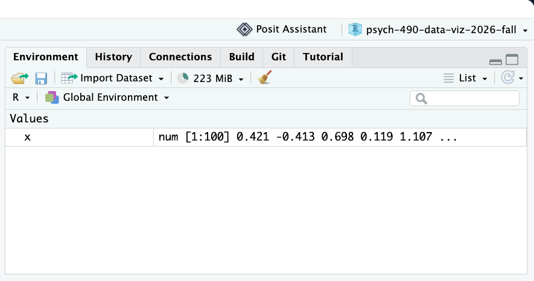
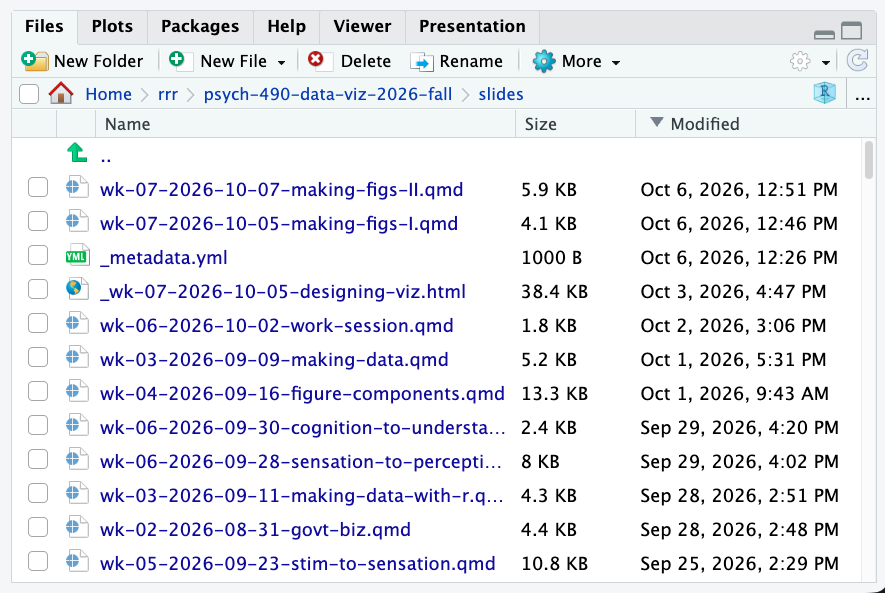

# Overview

## Announcements

- [Exercise 04](../exercises/ex-04-making-figs-ggplot.qmd) due this Friday

## Last time...

- Work session: Making figures on your own I

## Today

- Work session: Making figures on your own II
  - Preparation for [Exercise 04](../exercises/ex-04-making-figs-ggplot.qmd)
  
# Making figures on your own II

## Using RStudio

{#fig-rstudio-all-panes}

## Source pane

{#fig-rstudio-source width="75%"}

## Source pane 2

:::: {.columns}
::: {.column width=60%}

:::
::: {.column width=40%}
- Edit Quarto document here
:::
::::

## Console pane

{#fig-rstudio-r-console}

## Console pane 2

:::: {.columns}
::: {.column width=60%}

:::
::: {.column width=40%}
- Test R code here
- Ask for help: `help(ggplot2)`
:::
::::

## Environment pane

{#fig-rstudio-environment}

## Environment pane 2

:::: {.columns}
::: {.column width=60%}

:::
::: {.column width=40%}
- Any variables you create in the R console should appear here.
- That includes datasets you've named.
:::
::::

## Files pane

{#fig-rstudio-files width="65%" fig-align="center"}

## Files pane 2

:::: {.columns}
::: {.column width=60%}

:::
::: {.column width=40%}
- Files you've saved should appear here.
:::
::::

## Workflow best practices

1. Make a new RStudio project
2. Open a new Quarto document (see @fig-rstudio-source)
3. Modify *header info* in document 
4. Add headers to *body* of document

## Example {.scrollable}

`````rmarkdown
---
title: "My report"
author: "Rick Gilmore"
date: today
format: 
  html:
    embed-resources: true
---

## About

This page documents...

## Setup

```{{r}}

```

## Section header

### Section subheader

## Resources

`````

## Best practices

- Put code in code chunks in your Quarto document
  - Save file & render
  - Inspect HTML output
- OK to test short commands in R console (@fig-rstudio-r-console), but...
- Quarto doc shows your work
  - Space to take notes, make observations

## Best practices

- Import dataset into R session (if needed)
  - e.g., `library(ggplot2)` for *diamonds*,
  - `nfl_scheds <- nflreadr::load_schedules()` for the NFL schedule data
- Put import code in an R chunk below a subsection called `Import data` or something similar
  
## Best practices

- Run `summary()` using the *unquoted* name of the dataset
  - e.g., `summary(diamonds)` or `summary(nfl_scheds)`
  - The summary can be part of the import chunk or in a separate chunk
  
## Best practices {.scrollable}

:::: {.columns}
::: {.column width=50%}
- When in doubt, ask R to tell you if it "knows" the dataset
- Give R the *unquoted* name of the dataset^[You can also try this in the R console.]

:::
::: {.column width=50%}
```{{r}}
mtcars
```

::: {.fragment}
```{r}
#| label: mtcars
#| include: true
mtcars |> head()
```

:::
:::
::::
 
## Best practices

```{r}
#| label: setup
#| include: false
library(ggplot2)
```

:::: {.columns}
::: {.column width=50%}
- Make a separate chunk for each figure
:::
::: {.column width=50%}
````quarto
```{{r}}
#| label: fig-my-figure-01

# R code goes here...
```

````
:::
::::

## Best practices

:::: {.columns}
::: {.column width=50%}
- Each *ggplot* figure requires the following components at minimum:
  - Dataset, e.g. `ggplot(data = ...) +`
  - Aesthetic mapping(s): `aes(x = ...) +`
:::
::: {.column width=50%}
```{{r}}
#| label: fig-mtcars-wt-violin
ggplot(data = mtcars) +
  aes(x = wt) +
  geom_violin()
```
:::
::::

## Best practices

:::: {.columns}
::: {.column width=50%}
- Each *ggplot* figure requires the following components at minimum:
  - A `geom_`, e.g., `geom_histogram()` or `geom_violin()`
:::
::: {.column width=50%}
```{{r}}
#| label: fig-mtcars-wt-violin
ggplot(data = mtcars) +
  aes(x = wt) +
  geom_violin()
```

:::
::::

## Best practices

:::: {.columns}
::: {.column width=50%}
- The aesthetic(s) get "added" to the plot with the plus (`+`) character
- So does the `geom_`
:::
::: {.column width=50%}
```{{r}}
#| label: fig-mtcars-wt-violin
ggplot(data = mtcars) +
  aes(x = wt) +
  geom_violin()
```

::: {.fragment}

```{r}
#| label: fig-mtcars-wt-violin
ggplot(data = mtcars) +
  aes(x = wt) +
  geom_violin()
```

:::

:::
::::

---

## Some bells & whistles


## 

::: {.callout-note}
## Figure numbering is optional, but easy and useful

Note that the code chunk on the previous page added `#| label: fig-mtcars-wt-violin` before the actual code.
The `#|` tells Quarto that these are parameters for this particular R code chunk.
So, by saying `#| label:` we give the output figure from this chunk a unique name.
Doing so tells Quarto to add a figure number automatically.

The main benefit is that you can now write `@fig-mtcars-wt-violin` in your text, and Quarto will create a link to the figure. 

Here's what I mean:

In the previous slide, we made a violin plot of the *mtcars* wt variable (@fig-mtcars-wt-violin).

Slick, eh?
:::

## Figure captions

:::: {.columns}
::: {.column width=50%}
- Like figure numbering, figure captions are easy &  extremely useful
- Add `#| fig-cap: "My figure caption"` with your caption text below
- Put it below the figure label and name, but above your actual code
:::
::: {.column width=50%}
````quarto
```{{r}}
#| label: fig-mtcars-wt-boxplot
#| fig-cap: "A boxplot of the wt variable from the mtcars dataset."
ggplot(data = mtcars) +
  aes(x = wt) +
  geom_boxplot()
```
````

::: {.fragment}
```{r}
#| label: fig-mtcars-wt-boxplot
#| fig-cap: "A boxplot of the wt variable from the mtcars dataset. Click to see larger image. "
ggplot(data = mtcars) +
  aes(x = wt) +
  geom_boxplot()
```

:::
:::
::::

## Combining figure numbers & captions

- @fig-mtcars-wt-violin shows a violin plot of the wt variable.
- @fig-mtcars-wt-boxplot shows a boxplot of this variable.

::: {.callout-important}
## Hover-able & clickable figure links

You may hover^[Set `crossrefs-hover: true` in the YAML header under the `html:` or `revealjs:` sections.] over any of the named figure links above to see a preview.
Clicking takes you to the original page.
:::

## Add color

- If you're tired of gray bars and black points, try the `fill` or `color` aesthetics.

- `geom_histogram(bins = 30, color = "red")` makes all bar outlines red.
  
```{r}
#| echo: true
#| output-location: slide
rx <- rnorm(100)
df <- data.frame(rx)
ggplot(df) +
  aes(x = rx) +
  geom_histogram(bins = 30, color = "red")
```

## Add color 2

- `geom_histogram(bins = 30, fill = "blue")` *fills* the bars with blue.

```{r}
#| echo: true
#| output-location: slide
rx <- rnorm(100)
df <- data.frame(rx)
ggplot(df) +
  aes(x = rx) +
  geom_histogram(bins = 30, fill = "blue")
```

## Add color 3

- You can map a discrete (nominal or ordinal) variable to color.

```{r}
#| echo: true
#| output-location: slide
rx <- rnorm(100)
my_colors <- rep(c("color_1", "color_2"), each = 50)
df <- data.frame(rx, my_colors)
ggplot(df) +
  aes(x = rx, fill = my_colors) +
  geom_histogram(bins = 30)
```

## Change the axis labels

- Using the `xlab()` and `ylab()` functions, you can customize the axis labels.
- You need to "add" these annotations to your plot using the plus (`+`) syntax.

```{r}
#| echo: true
#| output-location: slide
rx <- rnorm(100)
my_colors <- rep(c("color_1", "color_2"), each = 50)
df <- data.frame(rx, my_colors)
ggplot(df) +
  aes(x = rx, fill = my_colors) +
  geom_histogram(bins = 30) +
  xlab("random number") +
  ylab("observed count")
```

# Wrap-up

## Main points

- Use these best practices for Exercise 04
- Work slowly and deliberately
- Save your Quarto document & render it often
- Ignore figure naming/numbering & captions unless you're feeling confident

## Why should I care?

:::: {.columns}
::: {.column width=50%}
- Skills >> knowledge^[You could ask an AI to do the work for you, but what have *you* learned?]
- Skill-building takes time & effort
- Scripted figures easier to build upon & reproduce
- Quarto document makes it easy to show your work
:::
::: {.column width=50%}

:::
::::

# Resources

## References
