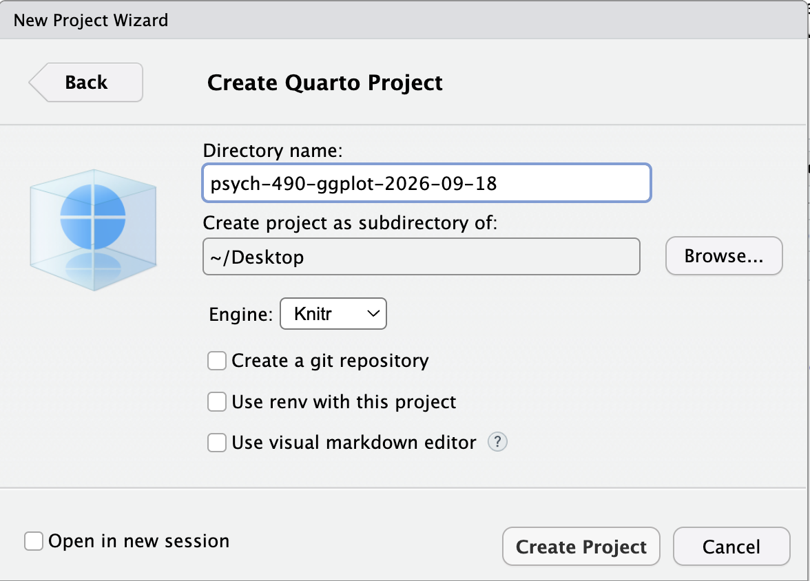
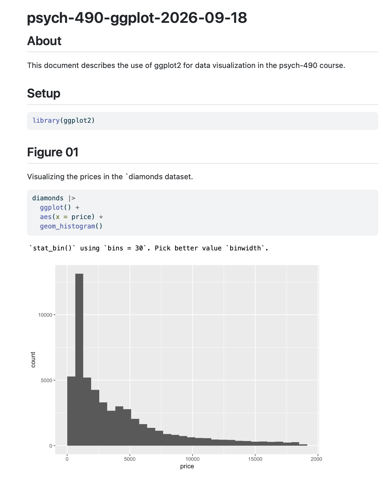

## About

This page provides some activities for beginning users of the `ggplot2` package.

## Get ready

### Create a new project

Let's open project to capture our work with `ggplot2`.

I suggest calling the project `ggplot-2026-09-18` or something similar.

:::: {.columns}
::: {.column width=50%}
{fig-align="center" #fig-file-menu-new-project width="25%"}
:::
::: {.column width=50%}
{fig-align="center" #fig-new-project-project-manager width="25%"}
:::
::::

---

{#fig-create-project-new-directory width="50%"}

---

{#fig-create-project-type-quarto width="50%"}

---

{#fig-new-ggplot2-project width="50%"}

## Edit the document

Let's customize this document for our use.

### Change the metadata

By default, the metadata at the top of your document looks like this:

```yaml
---
title: "psych-490-ggplot-2026-09-18"
---
```

Add an author field so that your metadata looks like this:

```yaml
title: "psych-490-ggplot-2026-09-18"
author:  "Jerome Doe"
```

Finally, add the following so that the rendered HTML file includes digital versions of any figures you render.
This will make it easy to share your work with others.

```yaml
format:
  html:
    self_contained: true
```

The full header should look like this:

```yaml
---
title: "psych-490-ggplot-2026-09-18"
author: "Your name"
format:
  html:
    self_contained: true
---
```

::: {.callout-important}
## Save early and often

I like to save my documents often.
That way I don't lose anything.

Memorize your computer's save command.
On Mac OS it's command + S.
On Windows, it's ctrl + S.

I also recommend checking the `Render on Save` box in RStudio.
That way every time you save, the document re-renders and opens in your browser.
:::

## Install `ggplot2`

Base R has many useful functions, but `ggplot2` is not one of them.
So, you will need to install it using the `install.packages()` function.

Switch to the R console, and install the package as follows:

```r
install.packages("ggplot2")
```

You'll only need to do this once.

## Using Quarto as a lab notebook

We're going to use Quarto as a lab notebook.

Each time we start a new thing, we're going to start a new section in our document.

### Add a `Setup` section

This is a good time to add a setup section to your document.
This section is where get ready to do real work.

So, add a chunk like this after your `About` section:

````markdown
## Setup
````

Below the setup header, we're going to add an R code chunk like this:

````{{r}}
library(ggplot2)
````

The `library()` command brings the package into the computational environment^[This is akin to bringing something into your working memory.] and lets us call the other functions and commands in `ggplot2` by their "first" names.

## Our first plot

Add a new section called `My First Plot` or `Figure 01` or something like that.

````markdown
## Figure 01
````

Then you might add some text explaining what the first plot is about. For example, you could describe the data being visualized and the purpose of the plot.

Here, we're going to use the `diamonds` dataset the is built in to `ggplot2`.

Create an R chunk as follows

````{{r}}
ggplot(data = diamonds) +
  aes(x = price) +
  geom_histogram()
````

::: {.callout-warning}
## Syntax slip-ups

90+% of frustrations with computers are because we don't tell them exactly what they need to know.

A code chunk in Quarto starts with triple backticks and ends with triple backticks.

The `{r}` tells Quarto that the code chunk is written in R.

Quarto understands other programming languages, so this is important.
:::

Save and render your Quarto document.

The resulting web page should look something like this:

{width="50%" #fig-01}

### Unpacking `ggplot` syntax

:::: {.columns}
::: {.column width=60%}
To make a figure, we need a dataset formatted as a data frame. The `diamonds` dataset is already in the right format.

In our plotting code, we call the `ggplot()` function and specify the dataset to plot using the `data=diamonds` command.

Next, we 'add' a layer to our figure using the `+` command.
That layer contains the 'aesthetics' or mapping between our dataset and some feature of the figur e (e.g., x position, y position, fill color, etc.)
We specify these mappings using the `aes()` command.
For this specific figure, we're mapping x position on the figure to the `price` variable in the dataset.

Finally, our figure needs a 'geom', a geometric object or format for the figure.
We have a single variable (`price`), and we want to plot a histogram of it, so we add (`+`) use the `geom_histogram()`.
:::
::: {.column width=40%}

::: {#fig-ggplot-diamonds}

````{{r}}
ggplot(data = diamonds) +
  aes(x = price) +
  geom_histogram()
````

:::
:::
::::

## Plot another variable

Let's plot another variable from the `diamonds` datasets.

Create a new subsection called `Figure 02` in your Quarto document, then create a new code chunk in your Quarto document with the following code:

:::: {#fig-diamonds-head}

````{{r}}
head(diamonds)
````

::::

The `head()` command outputs the first few rows of a data frame. This is useful for quickly inspecting the structure and contents of the data.

Let's make a histogram of the `carat` variable.
Make a new R chunk in your Quarto file; copy the Figure 1 code to the chunk; change the `x` value in the `aes()` function to read `aes(x = carat )`.

::: {#fig-diamonds-carat}

````{{r}}
ggplot(data = diamonds) +
  aes(x = carat) +
  geom_histogram()
````

Code to generate a histogram of the `carat` variable from the `diamonds` dataset.
:::

Save and render the Quarto document.

## Make violin plots

There are other 'geoms' we can use with continuous data like `price` and `carat`.

Again, make a 'Figure 03' section in your Quarto document.
Then, make a new code chunk with the following:

::: {#fig-violin-plots}

````{{r}}
ggplot(data = diamonds) +
  aes(x = price, y = "") +
  geom_violin()
  
ggplot(data = diamonds) +
  aes(y = carat, y = "") +
  geom_violin()
````

Code to create violin plots of both the `price` and `carat` variables.
:::

Save and render the Quarto document

Notice that `geom_violin()` requires us to both `x` and `y` aesthetics even if we only want to plot one variable. 
We tell `ggplot` to ignore the other mapping by setting `y=""`.

## Make a scatterplot

To wrap up this tutorial, let's make a scatterplot of `price` and `carat` using `geom_point` and setting the x and y aesthetics.

Make a Figure 04 section in your Quarto document, then add a code chunk with the following:

::: {#fig-diamonds-scatterplot}

````{{r}}
ggplot(data = diamonds) +
  aes(x = price, y = carat) +
  geom_point()
  
Code to create a scatterplot of the `price` and `carat` variables from the diamonds dataset.
````

:::

## Multiple violin plots

If you want to push yourself, add a Figure 05 section with the following code chunk.
Save and render the document, then explain what's going on with the figure.

::: {#fig-multiple-violin-plots}

````{{r}}
ggplot(data = diamonds) +
  aes(x = price, y = cut, color = cut, fill = cut) +
  geom_violin() +
  xlab("Price in $") +
  ylab("Cut of diamond") +
  ggtitle("Price vs. Cut")
````

Code to generate multiple violin plots, one for each value of the discrete (ordinal) variable `cut`. Note the use of new aesthetics `fill` and `color`, customized axis labels using `xlab()` and `ylab()` and a title using `ggtitle()`.
:::