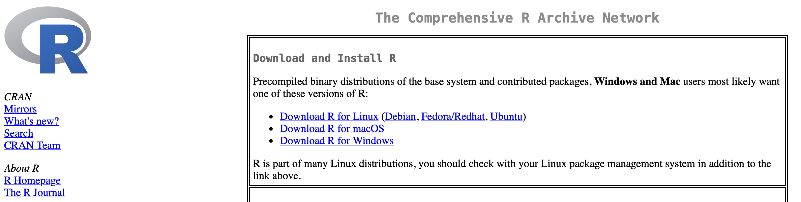
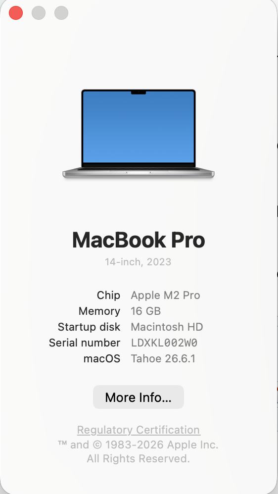

## About

This page provides information about how to install R and RStudio Desktop on your personal computer.
These are free, powerful software tools for data visualization and analysis.

## Order of operations

::: {.callout-note}
Installing R and RStudio Desktop is *usually* straightforward, but glitches arise from time to time.
If something's not working, try to seek help from an expert friend or the internet.
If you get frustrated, stop.
We'll spend time in-class helping with troubleshooting.
:::

You must install R first.

### Installing R

1. Visit <https://cran.r-project.org>

{#fig-cran}

2. Click on the "Download R for..." link appropriate for the operating system of your computer, proably Windows or macOS.
  - If you have a newer Mac, you want the version "For Apple Silicon": [R-4.6.1-arm64](https://lib.stat.cmu.edu/R/CRAN/bin/macosx/sonoma-arm64/base/R-4.6.1-arm64.pkg)
  
::: {.callout-important}
## Confirm your macOS operating system and hardware
Click on the Apple Menu in the upper left hand corner. Open the "About this Mac" menu item. A window will open.

{#fig-about-this-mac width="35%"}

Note that the operating system and hardware are displayed here.
Under *Chip*, the "Apple M2 Pro" means that my laptop is using Apple Silicon.
The *macOS* value says "Tahoe 26.6.1". R-4.6.1 works with all macOS > 14 (Sonoma).
:::

  - If you are on Windows, click on the "install R for the first time" link. Then download R-4.6.1 for Windows.
  
3. After you've downloaded the installer program. Open it. It is usually found in the default location for file downloads, often in a folder called "Downloads."

4. Open the installer program and follow the directions.

### Installing RStudio Desktop

Next install RStudio Desktop. Visit <https://docs.posit.co/ide/user/#rstudio-ide-oss-downloads>.

MacOS users select [RStudio-2026.07.1-147.dmg](https://download1.rstudio.org/electron/macos/RStudio-2026.07.1-147.dmg) and Windows Users select [RStudio-2026.07.1-147.exe](https://download1.rstudio.org/electron/windows/RStudio-2026.07.1-147.exe).

When the programs download, run the installation programs.

5. Open RStudio Desktop.

If RStudio Desktop opens successfully, do the computer happy dance.

{#fig-happy-dance}
